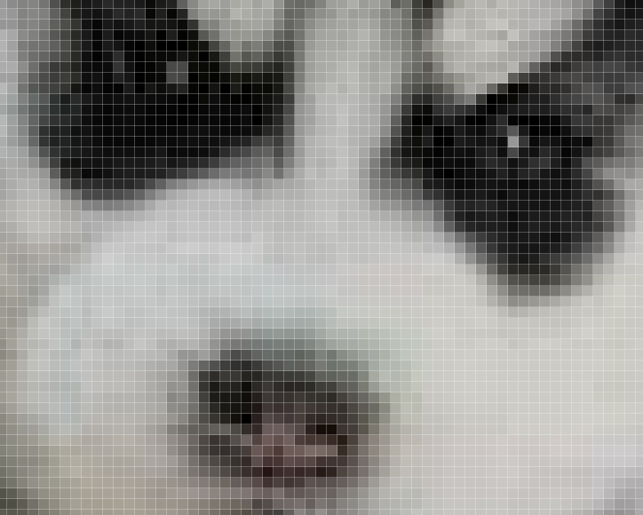

### 1-基础概念

#### 1-1-栅格系统

我们在说图像的时候，往往都是指点阵图、栅格图、位图。

而与其相对应的是图形，也做矢量图。

我接下来说的纹理，就是属于图像，其图像的建立和显示会遵循栅格系统里的规范。

比如，所有图像都是由像素组成的，在webgl里我们把像素称为片元，像素是按照相互垂直的行列排列的。

如下图：


将其放大后就可以看见其中的栅格：




图像中的每个像素都可以通过行数y和列数x来找到，由(x,y) 构成的点位，就是图像的像素坐标。

因为canvas画布也是一张图像，所以图像的栅格坐标系和我们之前说过的canvas2d的坐标系是一样的，我们可以简单回顾一下：


栅格坐标系的原点在左上角。

栅格坐标系的y 轴方向是朝下的。

栅格坐标系的坐标基底由两个分量组成，分别是一个像素的宽和一个像素的高。


#### 1-3-uv坐标系

我们在webgl里打图钉的时候，要考虑图钉在图像中的定位。

说到定位，大家不要先想位置，而是要先想坐标系，咱们接下来说一下图钉使用的uv坐标系。


uv坐标系，也叫st坐标系，大家以后见到了知道是一回事即可。

uv坐标系的坐标原点在图像的左下角，u轴在右，v轴在上。

u轴上的1个单位是图像的宽；

v轴上的一个单位是图像的高。

#### 1-4-采样器

采样器是按照图钉位置从图像中获取片元的方式。

我们在图像中所打的图钉位置，并不是图像中某一个片元的位置，因为片元位置走的是栅格坐标系。

所以我们需要一个采样器去对图钉的uv坐标系和像素的栅格坐标系做映射，从而去采集图像中图钉所对应的片元。

着色器基于一张图像可以建立一个，或多个采样器，不同的采样器可以定义不同的规则去获取图像中的片元。

采样器在着色器中是一种变量类型，写做sampler2D，它就像我们之前写过的vec4 类型一样，可以在片元着色器中通过uniform变量暴露给js，让js对其进行修改。

既然js可以对采样器进行修改了，那js必然会以某种方式向着色器传递其建立采样器所需的数据。

接下来咱们就先说一下这种的数据。

#### 1-5-纹理对象 

着色器使用一个纹理对象，就可以建立一个采样器。
纹理对象的建立需要一个图像源，比如Image 对象。
同是，我们还需要设置纹理对象和图钉进行数据映射的方式。
纹理对象是通过js 来建立的，js并不能直接将纹理对象传递给着色器。因为纹理对象说的是js 语言，说glsl es语言的着色器是不认识这种语言的。
所以，webgl 在浏览器底层为纹理对象建立了一块缓冲区，缓存区可以理解为用于存放纹理对象的磁盘空间，这块空间可以将纹理对象翻译成着色器可以读懂的数据。
之后我们会把这个空间的索引位置传给着色器，让着色器基于这个空间的索引位置，找到这个空间，然后再从空间中找到纹理对象，最后通过纹理对象建立采样器。
接下来咱们就说一下这个用于存储纹理对象的空间-纹理单元。

#### 1-6-纹理单元

纹理单元是一种专门用来存放纹理对象的缓冲区，就像我们之前用createBuffer()方法建立的用于存储数据源的缓冲区一样。
纹理单元是由webgl提前建立好的，只有固定的几个，如TEXTURE0|1|2|3|4|5|6|7|8，这就像我们实际中住的楼房单元一样，已经被webgl提前在浏览器中建立起来了，数量有限。
纹理单元虽然无需我们自己建立，但需要我们自己激活，让其进入使用状态。
基本概念咱们就说到这，接下来咱们看一下整体的代码实现。

### 4-纹理容器

我们之前在贴图的时候，默认图像源的尺寸只能是2的n次方，比如2、4、8、16、……、256、512等。

如果我们把图像的尺寸改成非2次幂尺寸，如300*300，那贴图就无法显示。

我们要想解决这种问题，就得设置一下纹理的容器。

我们在图像上打图钉的时候，形成一块uv区域，这块区域可以理解为纹理容器。

纹理容器可以定义图钉区域的纹理如何显示在webgl图形中。

通过对纹理容器的设置，我们可以实现以下功能：

- 非二次幂图像源的显示
- 纹理的复制
- 纹理的镜像

#### 4-1-非二次幂图像源的显示

```js
gl.texParameteri(
    gl.TEXTURE_2D,
    gl.TEXTURE_WRAP_S,
    gl.CLAMP_TO_EDGE
)
gl.texParameteri(
    gl.TEXTURE_2D,
    gl.TEXTURE_WRAP_T,
    gl.CLAMP_TO_EDGE
)
```

TEXTURE_WRAP_S和TEXTURE_WRAP_T 就是纹理容器在s方向和t方向的尺寸，这里的s、t就是st坐标系里的s、t，st坐标系和uv坐标系是一回事。

CLAMP_TO_EDGE 翻译过来就是边缘夹紧的意思，可以理解为任意尺寸的图像源都可以被宽高为1的uv尺寸夹紧。

注：只有CLAMP_TO_EDGE 才能实现非二次幂图像源的显示，其它的参数都不可以。

#### 4-2-纹理的复制

我们之前说过，uv坐标系的坐标基底分别是1个图片的宽和1个图片的高，可是如果我们将2个图片的宽高映射到了图形上会是什么结果呢？

默认是这样的：


这是由纹理容器的默认值决定的：

```js
gl.texParameteri(
    gl.TEXTURE_2D,
    gl.TEXTURE_WRAP_S,
    gl.REPEAT
)
gl.texParameteri(
    gl.TEXTURE_2D,
    gl.TEXTURE_WRAP_T,
    gl.REPEAT
)
```

REPEAT 就是纹理重复的意思。

#### 4-3-纹理的镜像复制

纹理的镜像复制可以实现纹理的水平、垂直翻转和复制。

效果如下：


代码如下：

```js
gl.texParameteri(
    gl.TEXTURE_2D,
    gl.TEXTURE_WRAP_S,
    gl.MIRRORED_REPEAT
)
gl.texParameteri(
    gl.TEXTURE_2D,
    gl.TEXTURE_WRAP_T,
    gl.MIRRORED_REPEAT
)
```

MIRRORED_REPEAT 就是镜像复制的意思。

我们也可以通过使用CLAMP_TO_EDGE 只对某一个方向纹理镜像复制。

```js
gl.texParameteri(
    gl.TEXTURE_2D,
    gl.TEXTURE_WRAP_S,
    gl.MIRRORED_REPEAT
)
gl.texParameteri(
    gl.TEXTURE_2D,
    gl.TEXTURE_WRAP_T,
    gl.CLAMP_TO_EDGE
)
```

效果如下：


### 5-分子贴图

分子贴图mipmap 是一种纹理映射技术。

比如：

webgl中有一个正方形，它在canvas画布中显示的时候，占据了2\*2个像素，我们要将一个8\*8的图像源贴上去。

正方形中肯定不能显示图像源中的所有像素，因为它只有2\*2=4个像素。

在Photoshop 中，会将图像源切割成2行、2列的色块，然后将每个色块的均值交个正方形。

在webgl 中也有类似的方法，并且它还有一层渲染性能的优化。

接下来咱们就说一下这层优化优化的是什么。

先想象一个场景，我要把1024\*1024的图像源映射到canvas画布上2\*2的正方形中，若把图像源分割求均值会产生庞大的数据运算，我们需要想办法把和正方形相映射的图像源的尺寸降到最小，比如就是2*2的。

因此，我们就需要[分子贴图](https://baike.baidu.com/item/Mipmap/3722136?fr=aladdin)了。

分子贴图是一个基于分辨率等比排列的图像集合，集合中每一项的宽高与其前一项宽高的比值都是1/2。

如下图：


在webgl 中，我们可以使用gl.generateMipmap() 方法为图像源创建分子贴图，

有了分子贴图后，之前2\*2的正方形便会从分子集合中寻找与其分辨率最接近的分子图像。

在找到分子图像后，就需要基于webgl图形的片元尺寸对其分割取色了。

对于取色的方法，咱们之前说一个均值算法，其实还有其它算法。

我们看一下webgl 给提供的方法。

```js
//创建分子贴图
gl.generateMipmap(gl.TEXTURE_2D);
//定义从分子图像中取色的方法
gl.texParameteri(
    gl.TEXTURE_2D,
    gl.TEXTURE_MAG_FILTER,
    gl.LINEAR
)
gl.texParameteri(
    gl.TEXTURE_2D,
    gl.TEXTURE_MIN_FILTER,
    gl.LINEAR
)
```
gl.texParameteri()方法中的第2个参数和第3个参数是键值对的关系。

TEXTURE_MAG_FILTER和TEXTURE_MIN_FILTER，对应的是纹理在webgl图形中的缩放情况。

- TEXTURE_MAG_FILTER  纹理放大滤波器，是纹理在webgl图形中被放大的情况。
- TEXTURE_MIN_FILTER   纹理缩小滤波器，是纹理在webgl图形中被缩小的情况。

TEXTURE_MAG_FILTER 具备以下参数：

- LINEAR (默认值) ，线性滤镜， 获取纹理坐标点附近4个像素的加权平均值，效果平滑 
- NEAREST 最近滤镜， 获得最靠近纹理坐标点的像素 ，效果锐利

TEXTURE_MIN_FILTER  具备以下参数：

- LINEAR 线性滤镜，获取纹理坐标点附近4个像素的加权平均值，效果平滑 
- NEAREST 最近滤镜， 获得最靠近纹理坐标点的像素，效果锐利
- NEAREST_MIPMAP_NEAREST  Select the nearest mip level and  perform nearest neighbor filtering . 
- NEAREST_MIPMAP_LINEAR (默认值) Perform a linear interpolation  between mip levels and perform  nearest neighbor filtering within  each .  
- LINEAR_MIPMAP_NEAREST Select the nearest mip level and  perform linear filtering within it .
- LINEAR_MIPMAP_LINEAR  Perform a linear interpolation  between mip levels and perform  linear filtering : also called trilinear  filtering .  

注：后面这4个与分子贴图相关的参数适合比较大的贴图，若是比较小的贴图，使用LINEAR 或NEAREST 就好。

注：缩小滤波器的默认值取色方法是NEAREST_MIPMAP_LINEAR ，这个方法会从分子贴图里找分子图像，然后从其中取色，然而当我们没有使用gl.generateMipmap()方法建立分子贴图的时候，就得给它一个不需要从分子贴图中去色的方法，如LINEAR或NEAREST。


### 6-多纹理模型

在我们实际开发中，经常会遇到一个模型，多个纹理的的情况。

比如这个魔方：


有时候我们会很自然的想到一个面给它一个贴图，而实际上，最高效的方式是一个物体给它一个贴图，如下图：

这样我们只需要加载一次图片，建立一个纹理对象，做一次纹理和顶点数据的映射就可以了。

## 第四章 纹理模块化

在three.js 里有一个专门的纹理对象Texture，建议大家在其官方文档看一下，将其属性和我之前所学过的纹理知识相互对照一下。

我接下来，就不再单独建立一个纹理对象了。

我直接将其合到我们之前写过的Poly对象里
## 第五章 纹理合成

纹理合成就是按照某种规则将多张图片合在一起。

比如这样：


 或者这样：


亦或者，这样：


### 4-2-在片元着色器中合成纹理

片元着色器：

```html
<script id="fragmentShader" type="x-shader/x-fragment">
    precision mediump float;
    uniform sampler2D u_Sampler;
    uniform sampler2D u_Pattern;
    varying vec2 v_Pin;
    void main(){
      vec4 o=texture2D(u_Sampler,v_Pin);
      vec4 p=texture2D(u_Pattern,v_Pin);
      gl_FragColor=p*o;
    }
</script>
```

- u_Sampler 是原始图片采样器，对应下图：


- u_Pattern 是纹理图案采样器，对应下图：


之后，我通过采样器找到原始图片和纹理图案的片元后，便可以对其进行运算；

```js
vec4 o=texture2D(u_Sampler,v_Pin);
vec4 p=texture2D(u_Pattern,v_Pin);
gl_FragColor=p*o;
```

上面的p*o便是在对片元做分量相乘的运算，这种算法会让原始图片的亮度变暗，有点类似于ps里的正片叠底。


举个例子说一下片元相乘的逻辑。

已知：

- 原始图像片元 o(ox,oy,oz,ow)
- 纹理图案片元 p(px,py,pz,pw)

求：p*o

解：

```js
p*o=(px*ox,py*oy,pz*oz,pw*ow)
```

通过此例可知：因为片元分量的值域为[0,1]，所以p*o 的亮度小于等于p和o 

- 当p=(1,1,1,1) 时，p*o=o

```js
p*o=(1*ox,1*oy,1*oz,1*ow)
p*o=(ox,oy,oz,ow)
```

- 当p=(0,0,0,0) 时，p*o=(0,0,0,0) 

关于片元相乘的方法我就说到这，接下来咱们再看几个常见的纹理合成方法。


### 4-3-纹理混合

纹理混合就是按照一定比例，将第一张图像合到另一张图像上，这类似于ps 里的透明度合成。

我们直接看一下纹理在片元着色里的合成方法。

```html
<script id="fragmentShader" type="x-shader/x-fragment">
    precision mediump float;
    uniform sampler2D u_Sampler;
    uniform sampler2D u_Pattern;
    varying vec2 v_Pin;
    void main(){
      vec4 o=texture2D(u_Sampler,v_Pin);
      vec4 p=texture2D(u_Pattern,v_Pin);
      gl_FragColor=mix(o,p,1.0);
    }
</script>
```
上面的mix() 方法便是按照比例对两个纹理的合成方法。
mix() 方法的返回数据类型会因其合成对象的不同而不同。
其规则如下：
```js
mix(m,n,a)=m+(n-m)*a
```
举个例子：

已知：

- m=3
- n=5
- a=0.5

求：mix(m,n,a)

解：

```js
mix(m,n,a)=3+(5-3)*0.5
mix(m,n,a)=3+2*0.5
mix(m,n,a)=4
```


再举个例子：

已知：

- m=(1,2,3)
- n=(3,4,5)
- a=0.5

求：mix(m,n,a)

解：

```js
mix(m,n,a)=(1+(3-1)*0.5,2+(4-2)*0.5,3+(5-3)*0.5)
mix(m,n,a)=(2,3,4)
```


简单总结一下mix(m,n,a) 方法的特性：

- 当a=0时，mix(m,n,a)=m
- 当a=1时，mix(m,n,a)=n

参考地址：https://www.khronos.org/registry/OpenGL-Refpages/gl4/

利用纹理混合，我们可以实现转场动画。

### 4-4-转场动画

转场动画就是场景的淡入、淡出。

我们可以将一个纹理理解为一个场景，利用转场动画实现淡入、淡出效果。

### 4-5-使用蒙版实现花样转场

蒙版是一种为图像的提供合成数据辅助图像。

蒙版通常是黑白的，若是彩色，还需要将其转灰。

蒙版中的片元数据是一种插值，并不是一种具备特定功能的数据。

比如，我们可以将蒙版中的片元数据做为两张图像的亮度合成插值、饱和度合成插值、透明度合成插值等等。

大家通常会将蒙版和遮罩混为一谈，其实那也无可厚非，蒙版和遮罩的底层原理都是一样的。

只是，遮罩一般会被当成透明度合成的数据，它遵守黑透白不透的规律。


接下来，我就通过蒙版来实现纹理的花样转场。

### 4-6-换装达人
我们先说一下换装达人的实现原理。

1.用一张黑白遮罩图对两个纹理图案进行裁剪，裁出裙子的区域。


2.对裙子区域的图案进行纹理混合


3.将纹理混合后的图案与原始图像进行正片叠底


纹理合成的方式还有很多很多，大家可以参考一下Photoshop里的图像合成：


还有canvas的[`globalCompositeOperation`](https://developer.mozilla.org/zh-CN/docs/Web/API/Canvas_API/Tutorial/Compositing#globalcompositeoperation)属性：


## 第六章 用跨域图像做贴图

我这里要说的跨域图像问题，并不单是webgl 问题，也是canvas 2d 里的问题。

为了更好的说清楚这个问题的来龙去脉，我这里就先从最简单的img标签说起。

### 1-img标签与跨域图像
我们用img 标签显示跨域图像的时候，我们只能将图像展示给用户，但并不能获取图像中的数据。
我们不能通过img标签获取图像数据，是浏览器出于安全考虑的，因为有的图像里可能会含有验证码、签名、或者其它不可告人的东东，这种数据是不能随意被别人获取的。
这时候，我们可能会想到通过canvas 2d获取图像数据。

### 2-获取图像数据

若图像是同域的，下面的方法是没问题的。
```js
const canvas=document.getElementById('canvas');
const ctx=canvas.getContext('2d');

const img=new Image();
img.src='https://img.kaikeba.com/70350130700202jusm.png';

img.onload=function(){
    const {width,height}=canvas
    ctx.drawImage(img,0,0)
    ctx.getImageData(0,0,width,height)
}
```

若图像是跨域的，那就会报错

其实不仅canvas 2d 是这样的，我们用webgl 获取跨域图像数据时，也会报错。

```js
const image = new Image()
image.src = 'http://img.yxyy.name/erha.jpg'
image.onload = function () {
    gl.texImage2D(
        gl.TEXTURE_2D,
        0,
        gl.RGB,
        gl.RGB,
        gl.UNSIGNED_BYTE,
        image
    )

    gl.texParameteri(
        gl.TEXTURE_2D,
        gl.TEXTURE_MIN_FILTER,
        gl.LINEAR
    )

    const u_Sampler = gl.getUniformLocation(gl.program, 'u_Sampler')
    gl.uniform1i(u_Sampler, 0)

    render()
}
```
由错误信息可知，代码跑到texImage2D()方法时卡住了，因为我们在这里面引用跨域图像了。

接下来我们可以使用CORS 跨域解决此问题。

### 3-CORS 跨域
CORS 的实现过程如下：
1.先让服务器向其它域名放权，比如 Apache 服务器需要这样设置：
```
Header set Access-Control-Allow-Origin "*"
```

上面代码的意思就是允许其它域名的网页跨域获取自己服务端的资源。
上面的* 是允许所有域名获取其服务端资源。
我们也可以写具体的域名，从而允许特定域名获取其服务端资源。

2.在网页里，通过特定的方法告诉服务端，我需要跨域获取你的资源。

其代码如下：

```js
const image = new Image()
image.src = 'http://img.yxyy.name/erha.jpg'
image.setAttribute("crossOrigin", 'Anonymous')
```

有了上面crossOrigin 属性的设置，无论是在canvas 2d里使用此图像源，还是在webgl里使用此图像源，都不会报错。

crossOrigin 接收的值有三种：
- undefined 是默认值，表示不需要向其它域名的服务器请求资源共享
- anonymous  向其它域名的服务器请求资源共享，但不需要向其发送任何信息
- use-credentials  向其它域名的服务器请求资源共享，并发送 cookies 等信息，服务器会通过这些信息决定是否授权
