## 第十七章 极坐标

极坐标的创始人是牛顿，主要应用于数学领域。

### 1-极坐标的基本概念

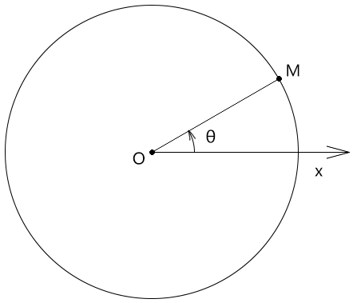

- 极点：极坐标的坐标原点，即点O
- 极轴：极坐标的起始轴，其对应的弧度为0，即Ox
- 正方向：极坐标中，点位按此方向的旋转量越大，其相对于极轴的弧度越大，此方向通常为逆时针方向
- 极径：极坐标系中一点到极点的距离，如|OM|
- 极角：极坐标系中一点相对于极轴的角度，如 θ
- 极坐标：由极坐标系中一点的极径和极角构成的有序数对，如(|OM|,θ)
- 极坐标系：按照以上原理确定某点的坐标位的坐标系


### 2-直角坐标系

gl_FragCoord所对应的二维直角坐标系中，y轴是朝上的，以像素为单位。

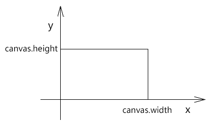

一个点的位置既可以用直角坐标来表示，也可以用极坐标来表示。

接下来我们说一下二维直角坐标系与极坐标系的转换方法。


### 3-极角与x轴的映射

我们可以通过极角与x轴的映射实现放射效果。

#### 3-1-放射

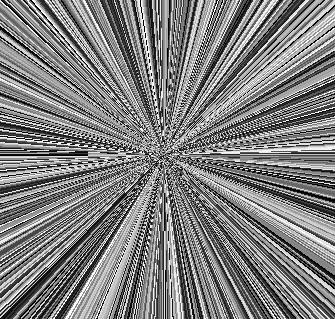


1.在片元着色器里基于画布尺寸计算画布中心位，声明360°所对应的弧度，以备后用。

```j's
uniform vec2 u_CanvasSize;
vec2 center=u_CanvasSize/2.0;
float pi2=radians(360.0);
```


2.以画布中心点为极点，计算当前片元的极角ang。

```js
void main(){
    vec2 p=gl_FragCoord.xy-center;
    float ang=atan(p.y,p.x);
    ……
}
```


3.以极角为变量，计算与计算一个x值

```js
float x=ang*16.0;
```


4.将x值拼上一个随意的y值，构成向量v

```js
vec2 v=vec2(int(x),0);
```


5.基于向量v，通过rand() 方法生成一个颜色

```js
vec2 v=vec2(int(x),0);
float f = rand(v); 
gl_FragColor = vec4(f, f, f, 1);
```

有了渐变的效果后，我们还可以让其旋转起来。


#### 3-2-渐变旋转

1.通过requestAnimationFrame() 方法向着色器传递一个时间戳 u_Stamp

```js
const rect = new Poly({
    gl,
    source,
    type: 'TRIANGLE_STRIP',
    attributes: {
        a_Position: {
            size: 2,
            index: 0
        }
    },
    uniforms: {
        u_CanvasSize: {
            type: 'uniform2fv',
            value: [canvas.width, canvas.height]
        },
        u_Stamp: {
            type: 'uniform1f',
            value: 0
        }
    }
})

!(function ani(stamp) {
    rect.uniforms.u_Stamp.value = stamp;
    rect.updateUniform();
    gl.clear(gl.COLOR_BUFFER_BIT);
    rect.draw()
    requestAnimationFrame(ani)
})()
```


2.在着色器中建立名为u_Stamp 的uniform 变量，并基于此变量建立只负责旋转的模型矩阵modelMatrix。

```js
uniform vec2 u_CanvasSize;
uniform float u_Stamp;

vec2 center=u_CanvasSize/2.0;
float pi2=radians(360.0);

float angOffset=u_Stamp*0.001;
float cosAng=cos(angOffset);
float sinAng=sin(angOffset);
mat2 modelMatrix=mat2(
    cosAng,sinAng,
    -sinAng,cosAng
);
```


3.在main() 方法中使用modelMatrix 旋转点p

```js
void main(){
    vec2 p=gl_FragCoord.xy-center;
    p=modelMatrix*p;
    float ang=atan(p.y,p.x);
    float x=ang*16.0;

    vec2 v=vec2(int(x),0);
    float f = rand(v); 
    gl_FragColor = vec4(f, f, f, 1);
}
```

以此原理，我还可以通过时间戳改变上面向量v 的y值，从而实现渐变闪烁。


#### 3-3-渐变闪烁

1.修改一下main 方法

```js
void main(){
    vec2 p=gl_FragCoord.xy-center;
    //p=modelMatrix*p;
    float ang=atan(p.y,p.x);
    float x=ang*16.0;

    vec2 v=vec2(int(x),int(u_Stamp));
    float f = rand(v); 
    gl_FragColor = vec4(f, f, f, 1);
}
```


2.控制一下闪烁速度

```js
let lastTime = 0
const timeLen = 100
!(function ani(stamp) {
    if (stamp % timeLen < lastTime % timeLen) {
        rect.uniforms.u_Stamp.value = stamp
        rect.updateUniform()
        gl.clear(gl.COLOR_BUFFER_BIT)
        rect.draw()
    }
    lastTime = stamp
    requestAnimationFrame(ani)
})()
```

知道了基本的动画原理后，我们还可以建立多极点放射效果，从而玩点艺术效果。


#### 3-4-来自深渊的凝视

下图两个极点之间的图形像一只眼睛，所以我就叫它“来自深渊的凝视”啦。


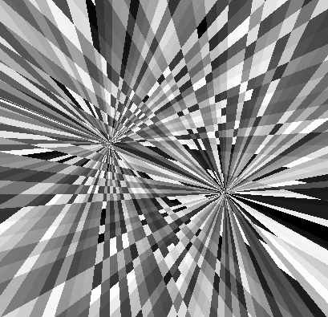


这个动画我是在放射旋转的基础上实现的，接下来我对其做一下修改。

1.建立两个模型矩阵

```js
float angOffset1=u_Stamp*0.0002;
float cosAng1=cos(angOffset1);
float sinAng1=sin(angOffset1);
mat2 modelMatrix1=mat2(
    cosAng1,sinAng1,
    -sinAng1,cosAng1
);

float angOffset2=u_Stamp*0.0008;
float cosAng2=cos(angOffset2);
float sinAng2=sin(angOffset2);
mat2 modelMatrix2=mat2(
    cosAng2,sinAng1,
    -sinAng2,cosAng2
);
```

- modelMatrix1 是用于旋转片元位的
- modelMatrix2 是用于旋转极点的。

注：modelMatrix2 中的第二个元素是sinAng1，不是sinAng2，我这么做是为打破一下其中规中矩的旋转方式。


2.将通过极坐标获取亮度的方法封装一下。

```js
float getBright(vec2 pole){
    pole=center+modelMatrix2*(pole-center);
    vec2 p=gl_FragCoord.xy-pole;
    p=modelMatrix1*p;
    float ang=atan(p.y,p.x);
    float x=ang*16.0;
    vec2 v=vec2(int(x),0);
    return rand(v);
}
```


3.在mian 中基于两个极点，获取两个亮度值。

```js
void main(){
    vec2 min=u_CanvasSize*0.35;
    vec2 max=u_CanvasSize*0.65;
    float bright1 = getBright(min);
    float bright2 = getBright(max);
    ……
}
```


4.对两个亮度值进行合成。

其合成思路是若两个亮度值都比较暗，那我就让当前片元变亮；若都比较亮，那我就让其变暗。

```js
void main(){
    vec2 min=u_CanvasSize*0.35;
    vec2 max=u_CanvasSize*0.65;
    float bright1 = getBright(min);
    float bright2 = getBright(max);
    
    float f=0.0;
    float sum=bright1+bright2;
    if(sum>1.0){
        f=bright1*bright2;
    }else{
        f=sum;
    }
    gl_FragColor = vec4(f, f, f, 1);
}
```

以此原理，我们还可以再玩点别的，比如来上四个极点。


#### 3-5-数字山谷

下面这张图我就叫它“数字山谷”了。

我要用它来体现数字山谷的现代、科技、格子玻璃、明快、琐碎、进取，以及看似杂乱莫测的变化中又蕴含着的规律。


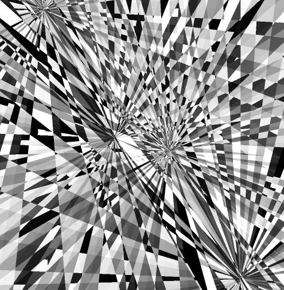


在“来自深渊的凝视”的基础上做一下修改。

1.修改一下矩阵变换的参数

```js
float angOffset1=u_Stamp*0.00015;
float cosAng1=cos(angOffset1);
float sinAng1=sin(angOffset1);
mat2 modelMatrix1=mat2(
    cosAng1,sinAng1,
    -sinAng1,cosAng1
);

float angOffset2=u_Stamp*0.0004;
float cosAng2=cos(angOffset2);
float sinAng2=sin(angOffset2);
mat2 modelMatrix2=mat2(
    cosAng2,sinAng1,
    -sinAng2,cosAng2
);
```


2.通过4个极点获取亮度值，然后对其合成

```js
void main(){
    vec2 min=u_CanvasSize*0.25;
    vec2 max=u_CanvasSize*0.75;
    float bright1 = getBright(min);
    float bright2 = getBright(max);
    float bright3 = getBright(vec2(min.x,max.y));
    float bright4 = getBright(vec2(max.x,min.y));
    float f=0.0;
    float sum=bright1+bright2+bright3+bright4;
    if(sum>2.0){
        f=bright1*bright2*bright3*bright4*4.0;
    }else{
        f=sum/2.0;
    }
    gl_FragColor = vec4(f, f, f, 1);
}
```


#### 3-6-正弦型放射

以前我们在说“一池春水”的时候，提到过正弦型函数，我们在这里也可以用正弦型函数做正弦型放射。

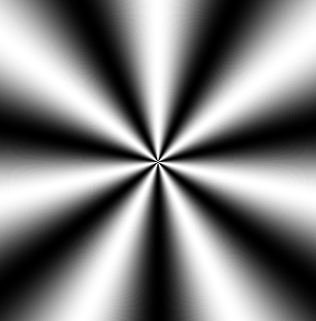

先回顾一下正弦型函数：

y=Asin(ωx+φ)

- A 影响的是正弦曲线的波动幅度
- φ 影响的是正弦曲线的平移
- ω 影响的是正弦曲线的周期，ω 越大，周期越小

接下来咱们说一下代码实现。

1.声明omega和a变量

```js
float omega=7.0;
float a=0.5;
```

- omega 对应的是正弦函数式里的ω，在放射效果中此值会影响射线的数量
- a 对应的是正弦函数式里的A，在放射效果中此值会影响亮度


2.在main方法中，以画布中心为极点，计算当前片元的极角

```js
void main(){
    vec2 p=gl_FragCoord.xy-center;
    float ang=atan(p.y,p.x);
    ……
}
```


3.以极角为变量计算正弦函数值

```js
float f = a*sin(omega*ang)+0.5; 
gl_FragColor = vec4(f, f, f, 1);
```

上面求f时加的0.5 是为了在[0,1]之间去亮度值：

- a\*sin(omega*x)∈[-0.5,0.5]
- a\*sin(omega*x)+0.5∈[0,1]

以此原理，我们还可以写点动画。


#### 3-7-光影沉浮

下图我就叫它“光影沉浮”了。

其动画原理和之前都是一样的，我就不再详解了。

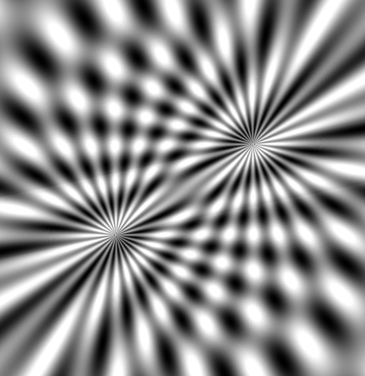

片元着色器如下：

```html
<script id="fragmentShader" type="x-shader/x-fragment">
    precision mediump float;
    uniform vec2 u_CanvasSize;
    uniform float u_Stamp;

    vec2 center=u_CanvasSize/2.0;
    float pi2=radians(360.0);

    float omega=24.0;
    float a=0.5;

    float angOffset1=u_Stamp*0.001;
    float cosAng1=cos(angOffset1);
    float sinAng1=sin(angOffset1);
    mat2 modelMatrix1=mat2(
      cosAng1,sinAng1,
      -sinAng1,cosAng1
    );

    float angOffset2=u_Stamp*0.001;
    float cosAng2=cos(angOffset2);
    float sinAng2=sin(angOffset2);
    mat2 modelMatrix2=mat2(
      cosAng2,sinAng2,
      -sinAng2,cosAng2
    );

    float getBright(vec2 pole){
      pole=center+modelMatrix2*(pole-center);
      vec2 p=gl_FragCoord.xy-pole;
      p=modelMatrix1*p;
      float ang=atan(p.y,p.x);
      return a*sin(omega*ang)+0.5;
    }

    void main(){
      vec2 min=u_CanvasSize*0.35;
      vec2 max=u_CanvasSize*0.65;
      float bright1 = getBright(min);
      float bright2 = getBright(max);
      float f=(bright1+bright2)*0.55;
      gl_FragColor = vec4(f, f, f, 1);
    }
</script>
```

或者，我们还可以再玩点别样的效果。


#### 3-8-湍流

下图具有流体效果，我就叫它“湍流”啦。

其动画原理和之前都是一样的，我就不再详解了。

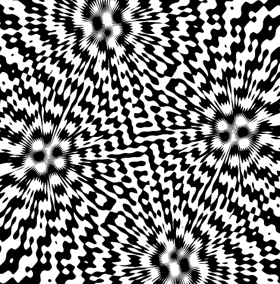

片元着色器如下：

```html
<script id="fragmentShader" type="x-shader/x-fragment">
    precision mediump float;
    uniform vec2 u_CanvasSize;
    uniform float u_Stamp;

    vec2 center=u_CanvasSize/2.0;
    float pi2=radians(360.0);

    float omega=64.0;
    float a=0.5;

    float angOffset1=u_Stamp*0.0004;
    float sinAng1=sin(angOffset1);

    float angOffset2=u_Stamp*0.0002;
    float cosAng2=cos(angOffset2);
    float sinAng2=sin(angOffset2);
    mat2 modelMatrix2=mat2(
      cosAng2,sinAng1,
      -sinAng2,cosAng2
    );

    float getBright(vec2 pole){
      pole=center+modelMatrix2*(pole-center);
      vec2 p=gl_FragCoord.xy-pole;
      float ang=atan(p.y,p.x);
      return a*sin(omega*ang)+0.5;
    }

    void main(){
      vec2 min=u_CanvasSize*0.25;
      vec2 max=u_CanvasSize*0.75;
      float bright1 = getBright(min);
      float bright2 = getBright(max);
      float bright3 = getBright(vec2(min.x,max.y));
      float bright4 = getBright(vec2(max.x,min.y));
      float f=0.0;
      float sum=bright1+bright2+bright3+bright4;
      if(sum<2.0){
        f=1.0;
      }
      gl_FragColor = vec4(f, f, f, 1);
    }
</script>
```


### 4-全景图的极坐标扭曲

下图是我提前准备好的全景图：

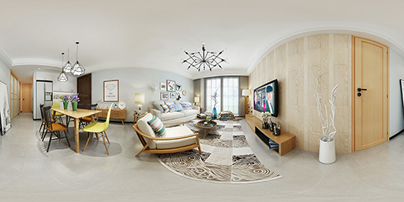


 极坐标扭曲效果如下： 

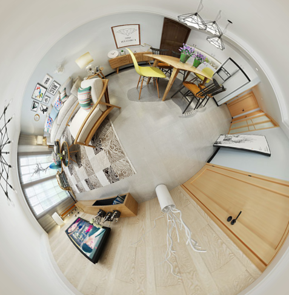

这就像广角镜头一样，接下来咱们说一下代码实现。


1.建立带贴图的rect对象

```js
const source = new Float32Array([
    -1, 1, 0, 1,
    -1, -1, 0, 0,
    1, 1, 1, 1,
    1, -1, 1, 0
]);

const rect = new Poly({
    gl,
    source,
    type: 'TRIANGLE_STRIP',
    attributes: {
        a_Position: {
            size: 2,
            index: 0
        },
        a_Pin: {
            size: 2,
            index: 2
        },
    },
    uniforms: {
        u_CanvasSize: {
            type: 'uniform2fv',
            value: [canvas.width, canvas.height]
        }
    }
})

const image = new Image()
image.src = './images/room.jpg'
image.onload = function () {
    rect.maps = {
        u_Sampler: { image },
    }
    rect.updateMaps()
    render()
}

//渲染
function render() {
    gl.clear(gl.COLOR_BUFFER_BIT);
    rect.draw()
}

```

2.顶点着色器

```html
<script id="vertexShader" type="x-shader/x-vertex">
    attribute vec4 a_Position;
    attribute vec2 a_Pin;
    varying vec2 v_Pin;
    void main(){
        gl_Position=a_Position;
        v_Pin=a_Pin;
    }
</script>

```


3.片元着色器

```html
<script id="fragmentShader" type="x-shader/x-fragment">
    precision mediump float;
    uniform vec2 u_CanvasSize;
    uniform sampler2D u_Sampler;
    varying vec2 v_Pin;
    vec2 center=u_CanvasSize/2.0;
    float diagLen=length(center);
    float pi2=radians(360.0);

    float getAngle(vec2 v){
      float ang=atan(v.y,v.x);
      if(ang<0.0){
          ang+=pi2;
      }
      return ang;
    }

    void main(){
      vec2 p=gl_FragCoord.xy-center;
      float ang=getAngle(p);
      float x=ang/pi2;
      float len=length(p);
      float y=len/diagLen;
      vec4 color=texture2D(u_Sampler,vec2(x,y));
      if(p.x>0.0&&abs(p.y)<1.0){
        color=texture2D(u_Sampler,vec2(0,y));
      }
      gl_FragColor=color;
    }
</script>
```


## 综合案例-磨砂金属按钮

接下来我们将之前说过的渐变、杂色、极坐标扭曲、拉丝融为一体，做一个磨砂金属按钮。

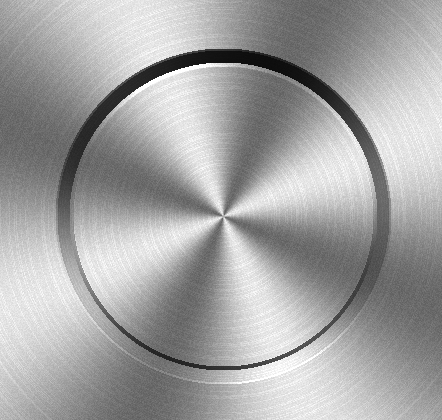


1.先制作一个磨砂材质

```html
<script id="fragmentShader" type="x-shader/x-fragment">
    precision mediump float;
    uniform vec2 u_CanvasSize;
    vec2 center=u_CanvasSize/2.0;
    float diagLen=length(center);
    float pi2=radians(360.0);
    float omega=4.0;
    float a=0.5;

    //渐变
    float gradient(float ang){
      return a*sin(omega*ang)+0.5; ;
    }

    //水平拉丝
    float wire(vec2 v){
      vec2 a= vec2(0.0,1.0);
      float n= dot(v,a);
      return fract(tan(n)*10000.0);
    }

    //杂色
    float noise(vec2 v){
      vec2 a= vec2(0.1234,0.5678);
      float n= dot(v,a);
      return fract(tan(n)*10000.0);
    }

    //获取弧度
    float getAngle(vec2 v){
      float ang=atan(v.y,v.x);
      if(ang<0.0){
          ang+=pi2;
      }
      return ang;
    }

    void main(){
      vec2 p=gl_FragCoord.xy-center;
      //极径
      float len=length(p);
      //极角
      float ang=getAngle(p);
      
      float x=u_CanvasSize.x*ang/pi2;
      float y=(len/diagLen)*u_CanvasSize.y;

	  //渐变
      float f1 = gradient(ang);
      f1=0.65*f1+0.5;

	  //拉丝
      float f2 = wire(vec2(int(x),int(y)));
      f2=clamp(f2,0.75,0.8);

	  //杂色
      float f3 = noise(gl_FragCoord.xy);
      f3*=0.07;

      //复合亮度
      float f=f1*f2+f3;

      gl_FragColor = vec4(vec3(f), 1);

    }
</script>
```

效果如下：

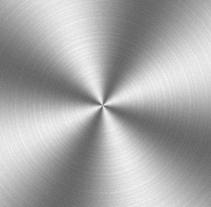


2.绘制凸出效果，对复合亮度做一下加工。

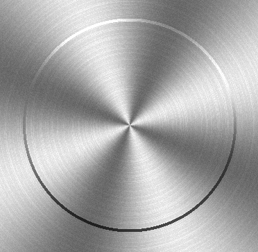

```js
float ratio1=smoothstep(-1.0,1.0,sin(ang));
float r=150.0;
float expand1=r+4.0;
if(len>r&&len<expand1){
    f*=ratio1+0.3;
}
```

smoothstep(edge0,edge1,x) 求x在edge0和edge1间的插值[0,1]

- 若x<edge0 返回0

- 若x>edge1 返回1

- 否则返回x 在edge0和edge1间的插值

例子：

smoothstep(3,7,1)=0

smoothstep(3,7,8)=1

smoothstep(3,7,5)=(5-3)/(7-3)=2/4=0.5


sin(ang)的单调性：

- ang∈[-π/2,π/2] 时，ang越大，sin(ang)越大
- ang∈[π/2,π/2+π] 时，ang越大，sin(ang)越小


3.以此原理，我们还可以再做一圈凹陷效果。

```js
float ratio1=smoothstep(-1.0,1.0,sin(ang));
float ratio2=1.0-ratio1;
float r=150.0;
float expand1=r+4.0;
float expand2=expand1+12.0;
if(len>r&&len<expand1){
    f*=ratio1+0.3;
}else if(len>expand1&&len<expand2){
    f*=ratio2+0.1;
}
```

效果如下：

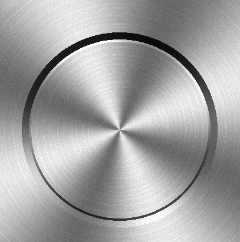

上面的ratio2 是实现了一个自上到下，由暗到亮的效果。


4.我们还可以再来一圈渐变，使凹凸效果更具层次。

```js
float ratio1=smoothstep(-1.0,1.0,sin(ang));
float ratio2=1.0-ratio1;
float r=150.0;
float expand1=r+4.0;
float expand2=expand1+12.0;
float expand3=expand2+2.0;
if(len>r&&len<expand1){
    f*=ratio1+0.3;
}else if(len>expand1&&len<expand2){
    f*=ratio2+0.1;
}else if(len>expand2&&len<expand3){
    f*=ratio2+0.3;
}
```

效果如下：

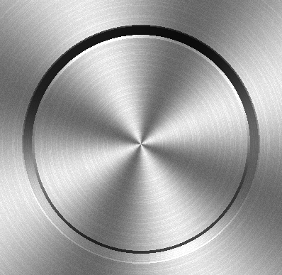


5.我也可以对代码做一点优化，把亮度和半径各自装进一个集合里。

```js
//片元亮度集合
float ratio1=(sin(ang)+1.0)/2.0;
float ratio2=1.0-ratio1;
float ls[3];
ls[0]=f*(ratio1+0.3);
ls[1]=f*(ratio2+0.1);
ls[2]=f*(ratio2+0.3);

//初始半径
float r=150.0;
//半径集合
float rs[3];
rs[0]=r+4.0;
rs[1]=rs[0]+12.0;
rs[2]=rs[1]+2.0;

//基于len值，计算片元亮度
for(int i=0;i<3;i++){
    if(len>=r&&len<rs[i]){
        f=ls[i];
        break;
    }
    r=rs[i];
}
```


## 新鲜空气-Element3+WebGL

Element3是基于vue3.0 造的轮子，它是由许多大神主导开发的，比如Winter、大圣、春去春又来等。

其中有一个“rollup-plugin-element3-webgl” 依赖，可以在自定义的着色器组件上绑定动态数据，从而驱动片元着色器的渲染。

接下来我们就先小试一下。

### 1-环境配置

1.安装nodejs

2.全局安装vite 

```js
npm install -g vite
```

3.建立一个目录，初始化项目，建立 package.json 

```
npm init
```

4.在 package.json 中写入依赖

```json
{
  "name": "09-element3-webgl",
  "version": "1.0.0",
  "description": "",
  "main": "index.js",
  "dependencies": {
    "element3-core": "0.0.7",
    "vue": "^3.0.5"
  },
  "devDependencies": {
    "@vitejs/plugin-vue": "^1.2.2",
    "@vue/compiler-sfc": "^3.0.5",
    "rollup-plugin-element3-webgl": "0.0.5",
    "typescript": "^4.1.3",
    "vite": "^2.3.0",
    "vue-tsc": "^0.0.24"
  },
  "scripts": {
    "test": "echo \"Error: no test specified\" && exit 1"
  }
}
```


5. 创建文件和基本目录结构。 

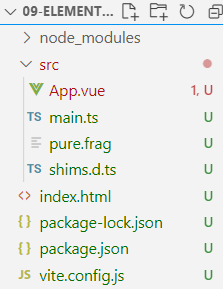


index.html

```html
<!DOCTYPE html>
<html lang="en">

<head>
  <meta charset="UTF-8" />
  <link rel="icon" href="/favicon.ico" />
  <meta name="viewport" content="width=device-width, initial-scale=1.0" />
  <title>Vite App</title>
</head>

<body>
  <div id="app"></div>
  <script type="module" src="/src/main.ts"></script>
</body>

</html>
```


vite.config.js 

```js
import { defineConfig } from "vite";
import vue from "@vitejs/plugin-vue";
import element3Webgl from "rollup-plugin-element3-webgl";

// https://vitejs.dev/config/
export default defineConfig({
  base: "/", 
  plugins: [vue(), element3Webgl()],
});
```


建立src目录

main.ts

```ts
import { createApp } from "vue";
import App from "./App.vue";

createApp(App).mount("#app");
```


App.vue

```vue
<template>
<div>
    <DrawBlock 
    :u_Width="600" 
    :u_Height="600"
    :u_Radius="200"
    width=600
    height=600
    ></DrawBlock>
</div>
</template>
<script lang="ts">

import { defineComponent } from "vue";
import DrawBlock from "./pure.frag";

export default defineComponent({
  name: "App",
  components: {
    DrawBlock
  },
  setup(){
    return {
      
    }
  }
});

</script>
```


pure.frag

```frag
precision mediump float;

uniform float u_Width;
uniform float u_Height;
uniform float u_Radius;

void main() {
  vec2 center=vec2(u_Width,u_Height)/2.0;
  vec2 p=gl_FragCoord.xy-center;
  float l = length(p);
  if(l<u_Radius){
    gl_FragColor=vec4(1,1,0,1);
  }else{
    gl_FragColor = vec4(0, 0, 0, 1);
  }
}
```


最终效果就是一个红色的圆圈。

接下来我们把之前写过的磨砂金属作为Element3 组件的皮肤。


### 2-金属Switch

金属Switch的效果如下：


1.建立switch 组件

```vue
<template>
  <E3Switch
    v-model="enabled"
    class="
      relative 
      focus:outline-none
    "
  >
    <draw
      width="100" 
      height="100"
      :iTime="0"
      :iWidth="buttonWidth"
      :iHeight="buttonHeight"
      :style="enabled?buttonEnterStyle:buttonStyle"
    ></draw>
    <div :style="backgroundStyle"></div>
  </E3Switch>
</template>

<script>
import { ref } from "vue";
import { E3Switch } from "element3-core";
import draw from "./metal.frag";
export default {
  components: {
    E3Switch,
    draw,
  },
  setup() {
    const enabled = ref(false);

    const buttonStyle = {
      width:"40px",
      height:"40px",
      transform:"translate(0px,0px)",
      borderRadius:"50%",
      position:"absolute",
      left:"17px",
      top:"14px",
      boxShadow:"0px 3px 4px #000",
      transition:"all .2s ease-in"
    }

    const buttonEnterStyle = {
      width:"40px",
      height:"40px",
      transform:"translate(32px,0px)",
      borderRadius:"50%",
      position:"absolute",
      left:"17px",
      top:"14px",
      boxShadow:"0px 3px 4px #000",
      transition:"all .2s ease-in"
    }

    const buttonWidth = ref(100);
    const buttonHeight = ref(100);

    const backgroundStyle = {
      background: "linear-gradient(#333, #666)",
      width: "70px",
      height:"44px",
      borderRadius:"25px",
      border:"2px solid #333",
    }

    return { buttonWidth,buttonHeight,backgroundStyle,enabled,buttonStyle,buttonEnterStyle};
  },
};
</script>

<style></style>
```


2.金属材质

```frag
precision mediump float;

uniform float iWidth;
uniform float iHeight;

vec2 u_CanvasSize = vec2(iWidth, iHeight);
vec2 center = u_CanvasSize / 2.0;
float diagLen = length(center);
float pi2 = radians(360.0);
float omega=4.0;
float a=0.5;

//渐变
float gradient(float ang){
	return a*sin(omega*ang)+0.5; ;
}

//水平拉丝
float wire(vec2 v){
    vec2 a= vec2(0.0,1.0);
    float n= dot(v,a);
    return fract(tan(n)*10000.0);
}

//杂色
float noise(vec2 v){
    vec2 a= vec2(0.1234,0.5678);
    float n= dot(v,a);
    return fract(tan(n)*10000.0);
}

//获取弧度
float getAngle(vec2 v){
    float ang=atan(v.y,v.x);
    if(ang<0.0){
    	ang+=pi2;
    }
    return ang;
}

void main(){
    vec2 p=gl_FragCoord.xy-center;
    float len=length(p);
    float ang=getAngle(p);
    float x=u_CanvasSize.x*ang/pi2;
    float y=(len/diagLen)*u_CanvasSize.y;

    float f1 = gradient(ang);
    f1=0.65*f1+0.5;

    float f2 = wire(vec2(int(x),int(y)));
    f2=clamp(f2,0.75,0.8);

    float f3 = noise(gl_FragCoord.xy);
    f3*=0.07;

    //复合亮度
    float f=f1*f2+f3;

    //片元亮度集合
    float ratio1=smoothstep(-1.0,1.0,sin(ang));
    float ratio2=1.0-ratio1;
    float ls[3];
    ls[0]=f*(ratio1+0.3);
    ls[1]=f*(ratio2+0.1);
    ls[2]=f*(ratio2+0.3);

    //初始半径
    float r=150.0;
    //半径集合
    float rs[3];
    rs[0]=r+4.0;
    rs[1]=rs[0]+12.0;
    rs[2]=rs[1]+2.0;

    //基于len值，计算片元亮度
    for(int i=0;i<3;i++){
        if(len>=r&&len<rs[i]){
            f=ls[i];
            break;
        }
        r=rs[i];
    }

    gl_FragColor = vec4(vec3(f), 1);
}
```


## 总结

这一篇，我们说了GLSL ES 语言的各种语法规则，并且列举了许多用GLSL ES 语言玩转片元的案例。

其实片元着色器的水也是很深很深的，我现在所说的，连冰山一角都算不上。

在片元方面的控色我还没说，比如RGB与HSL的相互转换、对比度、色阶等等。

以此为基础，我们还可以开发更多炫酷的效果，比如火焰、云彩等等。

然而，现在我不得不先打住，不然我们的课程就得往后再拖一个月了。

大家学到现在，对GLSL ES语法的操作应该是没问题的了。

等我走完整个课程，我们回头再玩片元着色器。