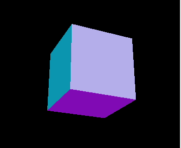

## 前言

### 课件地址

https://github.com/buglas/threejs-lesson


### 课前准备  

1. 需掌握es6、html、css 的基础知识。
2. 图形学基础，三角函数、向量、矩阵等。
3. WebGL  基础。


### 课堂目标  

1. 认识three.js
2. 掌握three.js 基本绘图原理和流程


### 知识点  

1. threejs 概述
2. 搭建threejs 场景


## 第一章 three.js 概述

### 1-three.js 是什么？

three.js是用JavaScript编写的WebGL第三方库，在我们的课程里就将其简称为three 了。

three 提供了非常多的3D显示和编辑功能。

具体而言，three 是一款运行在浏览器中的 3D 引擎，你可以用three  创建各种三维场景，并对其进行编辑。

在three 的官网上看到许多精彩的演示和文档。

three 官网：https://threejs.org/

github：https://github.com/mrdoob/three.js


### 2-three 的优缺点

优点：

- 对WebGL 进行了深度封装，可以提高常见项目的开发速度。
- 入门简单，精通较难，需图形学基础。
- 具备较好的生态环境，文档详细，持续更新，在国内的使用者很多，就业需求也很大。

缺点：

- 在Node.js 中引用困难。在 Node.js v12 中， three.js 的核心库可使用 require('three') 来作为 CommonJS module 进行导入。然而，大多数在 examples/jsm 中的示例组件并不能够这样。

- 个别功能封装过紧，限制了其灵活性。

  

### 3-three 适合做什么

three 适合三维项目的开发和展示，比如VR、AR、三维产品展示、三维家居设计……

three 也可以做游戏开发，只是相较于Babylon，缺少了物理引擎。


## 第二章 牛刀小试-旋转的立方体

接下来我们要搭建一个场景，这个场景里面有一个旋转的立方体。



1.建立一个HTML文件，引入three 。

```html
<!DOCTYPE html>
<html>
	<head>
		<meta charset="utf-8">
		<title>牛刀小试p</title>
		<style>
			body { margin: 0; }
		</style>
	</head>
	<body>
		<script src="https://unpkg.com/three/build/three.js"></script>
		<script>
			// Our Javascript will go here.
		</script>
	</body>
</html>
```


2.创建一个场景。

```js
const scene = new THREE.Scene();
const camera = new THREE.PerspectiveCamera( 75, window.innerWidth / window.innerHeight, 0.1, 1000 );

const renderer = new THREE.WebGLRenderer();
renderer.setSize( window.innerWidth, window.innerHeight );
document.body.appendChild( renderer.domElement );
```

我们现在建立了场景、相机和渲染器，对于其中参数的意思，可以去[官网](https://threejs.org/docs/index.html#manual/en/introduction/Creating-a-scene)查阅文档。


3.创建立方体。

```js
const geometry = new THREE.BoxGeometry();
const material = new THREE.MeshNormalMaterial();
const cube = new THREE.Mesh(geometry, material);
scene.add(cube);

camera.position.z = 5;
```


4.在连续渲染方法里旋转立方体。

```js
animate()
function animate() {
  requestAnimationFrame( animate );

  cube.rotation.x += 0.01;
  cube.rotation.y += 0.01;

  renderer.render( scene, camera );
};
```

祝贺你！你现在已经成功完成了你的第一个Three.js应用程序。

虽然它很简单，但现在你已经有了一个入门的起点。 


## 第三章 用webpack+ts 开发three 项目

我们之前说webgl的时候，是以夯实基础为目的。

而现在的three，我会逐步往实战靠拢。

现在，webpack 依旧是主流的模块打包工具，这在大部分公司的项目开发中是必不可少的。

ts和three 是绝配，three本身就是用ts写的，ts可以为three 项目提前做好规则约束，使项目的开发更加顺畅。

因此，我接下来会跟大说一下如何用webpack+ts 写three。

对于主流的前端框架vue、react，前期还不是特别需要，我会放到后面说。

我当前选择的webpack 是最新版本的webpack 5，具体[指南](https://webpack.docschina.org/guides/getting-started/)可参考官网。


1.创建一个目录，初始化 npm

```
mkdir 01-start
cd 01-start
npm init -y
```


2.调整 `package.json` 文件，以便确保我们安装包是 `private(私有的)`，并且移除 `main` 入口。这可以防止意外发布你的代码。

```diff
 {
   "name": "webpack-demo",
   "version": "1.0.0",
   "description": "",
-  "main": "index.js",
+  "private": true,
   "scripts": {
     "test": "echo \"Error: no test specified\" && exit 1"
   },
   "keywords": [],
   "author": "",
   "license": "MIT",
   "devDependencies": {
     "webpack": "^5.38.1",
     "webpack-cli": "^4.7.2",
   }
 }
```


3.安装依赖文件

- webpack 相关的依赖

```
npm install webpack webpack-cli webpack-dev-server --save-dev
```

- ts 相关的依赖

```
npm install typescript ts-loader --save-dev
```

- three 相关的依赖

```
npm install three @types/three --save
```

package.json 如下：

```json
{
  "name": "three-lesson-02",
  "version": "1.0.0",
  "description": "",
  "private": true,
  "scripts": {
    "test": "echo \"Error: no test specified\" && exit 1",
    "start": "webpack serve --open",
  },
  "keywords": [],
  "author": "",
  "license": "ISC",
  "devDependencies": {
    "ts-loader": "^9.2.8",
    "typescript": "^4.6.2",
    "webpack": "^5.70.0",
    "webpack-cli": "^4.9.2",
    "webpack-dev-server": "^4.7.4"
  },
  "dependencies": {
    "@types/three": "^0.138.0",
    "three": "^0.138.3"
  }
}
```


4.建立项目文件。

- 目录结构

```diff
01-start
|- dist
	|- 01-helloWorld.html
|- src
	|- helloWorld.ts
|- package.json
|- package-lock.json
|- tsconfig.json
|- webpack.config.js
```


- dist/01-helloWorld.html

```html
<!DOCTYPE html>
<html>
  <head>
    <meta charset="utf-8" />
    <title>helloWorld</title>
    <style>
      body {
        margin: 0;
        overflow: hidden;
      }
    </style>
  </head>
  <body>
    <canvas id="canvas"></canvas>
    <script src="helloWorld.js"></script>
  </body>
</html>
```


- src/helloWorld.ts

```js
const str:string='Hello World'
console.log(str)
```


- webpack.config.js

```js
const path = require('path');

module.exports = {
  mode: 'development',
  entry: {
    helloWorld: './src/helloWorld.ts',
  },
  devtool: 'inline-source-map',
  devServer: {
    static: './dist',
  },
  output: {
    filename: '[name].js',
    path: path.resolve(__dirname, 'dist'),
  },
  resolve: {
    extensions: [".ts", ".tsx", ".js"]
  },
  module: {
    rules: [
      { test: /\.tsx?$/, loader: "ts-loader" }
    ]
  }
};
```


- tsconfig.json

```
{
  "compilerOptions": {
    "sourceMap": true,
    "target": "es6",
    "module": "es6"
  }
}
```


5.运行项目，若在01-helloWorld.html中打印出“Hello World”，就说明配置没有问题。

```
npm run start
```


6.多页面。

在dist 中再建立一个页面 02-box.html，用来显示我们入门时绘制的立方体。

```html
<!DOCTYPE html>
<html>

<head>
  <meta charset="utf-8" />
  <title>box</title>
  <style>
    body {
      margin: 0;
      overflow: hidden;
    }
  </style>
</head>

<body>
  <canvas id="canvas"></canvas>
  <script src="box.js"></script>
</body>

</html>
```

在src 中建立一个box.js 文件，用于绘制立方体：

```js
import {
  BoxGeometry,Mesh,MeshNormalMaterial,PerspectiveCamera,Scene,WebGLRenderer,
} from 'three'

const scene = new Scene()
const camera = new PerspectiveCamera( 75, window.innerWidth / window.innerHeight, 0.1, 1000 )

const canvas = <HTMLCanvasElement>document.getElementById('canvas');
canvas.width = window.innerWidth;
canvas.height = window.innerHeight;
const renderer = new WebGLRenderer({canvas});

const geometry = new BoxGeometry();
const material = new MeshNormalMaterial();
const cube = new Mesh( geometry, material )
scene.add( cube );

camera.position.z = 5;

function animate() {
  requestAnimationFrame( animate )

  cube.rotation.x += 0.01
  cube.rotation.y += 0.01

  renderer.render( scene, camera )
};

animate();
```


在webpack.config.js 中添加彩色立方体页面所对应的入口

```js
module.exports = {
  ……
  entry: {
    helloWorld: './src/helloWorld.ts',
    box: './src/box.ts',
  },
  ……
};
```

启服务后，打开box.html 页面，便可以看见旋转的立方体。


