## 前言

### 课件地址

https://github.com/buglas/threejs-lesson


### 课堂目标  

- 理解three 开发项目的整体流程
- 实现三维机房的展示和交互


### 知识点  

- 场景 Scene
- 透视相机 PerspectiveCamera
- 基础材质 MeshBasicMaterial
- 几何体 BufferGeometry
- 网格对象 Mesh
- 渲染对象 WebGLRenderer
- 轨道控制器 OrbitControls


## 项目概述

按理说，学习一门新技术的时候，没有一入门就实战的。

但是，有个三维机房的案例，确实很适合一入门就实战，因为它是很简单，很经典，也很适合我们统揽全局，看一下threejs 是如何实战的。


等说完这个案例，我们会从基础慢慢说threejs。


### 1-IT机房简介

在一些安全要求比较高的企业，比如电信、网通、移动等，都有自己的独立服务器，而不是使用阿里云、腾讯云之类的第三方服务器。

这种大企业的服务器可能很多，需要装进IT 机柜里。

一般小点的企业的服务器需要二三十个机柜，而大的则需要上千个机柜。

IT 机房就是用于放置这些机柜的房间。


### 2-三维IT机房

随着科技的进步和信息化进程的推进，IT机房的重要性越来越高，企业需要对IT机房进行更加妥善的管理和监控，比如实时监控机房的温度和湿度。

现在市面上好点的IT 机柜都可以将其内部数据同步到服务端，这个时候，虚拟现实的三维IT机房便有了用武之地。

三维IT机房可以将机房数据可视化，让企业更好的监控和管理IT 机柜。


### 3-项目需求

当前这个项目先不整太复杂了，毕竟现在还是入门阶段，以后再逐步深入。

咱们先说几个IT 机房的几个常见功能：

1. 在前端页面对IT 机房进行三维展示。
2. 当鼠标划入IT 机柜的时候，提示当前机柜的详细信息。
3. 一键显示机房中过热的机柜。


## react+ts+threejs 开发三维IT机房

react+ts 是我当前所知的大部分企业开发三维项目的标配，所以我着这里就选择了react+ts。

当然，若大家擅长vue，用vue+ts 开发three 项目也可以。


### 1-准备一份IT机房模型

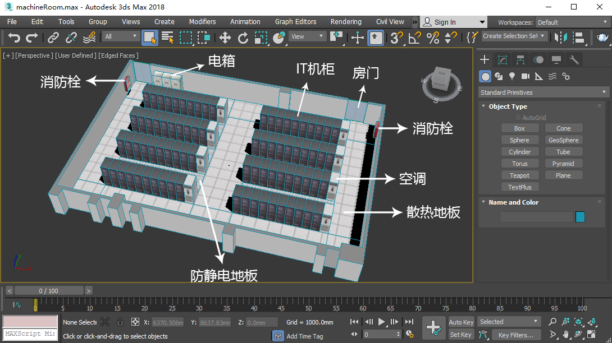

注：此机房布局仅供参考，不具专业效益，具体布局需考虑产品、环境和企业需求等。

#### 1-1-建模思路

- 简化模型，能用贴图表现的细节，就用贴图。这样可提高渲染速度。
- 将光效融入贴图中，即模型贴图后便具备光效和体感。这样在three 中就无需打灯，即可提高开发速度，亦可提高渲染效率。


#### 1-2-建模软件

现在市面上可以3d建模的软件有很多，3dsMax、Blender、C4D 都可以。

3dsMax 相对更复杂一些，不过因为我大学就是学的这个，所以就用3dsMax建模了。

我当前用的3dsMax 版本是2018，无法导出gltf 文件，所以还需要安装一个[gltf 文件导出插件](https://github.com/KhronosGroup/glTF/)。

具体的建模和导出gltf 的过程，我先不做具体讲解，因为一般公司都是有专门的建模师。

等实战案例结束后，我会作为扩展内容，在视频里给大家演示一下建模和导出gltf 的过程。


#### 1-3-模型文件

GLTF 模型文件包含了整个场景的数据，比如几何体、材质、动画、相机等。

GLTF  模型在使用起来，要比传统的obj 模型方便很多。

在导出GLTF模型后，一般会包含以下文件：

- gltf 模型文件
- bin文件
- 贴图文件

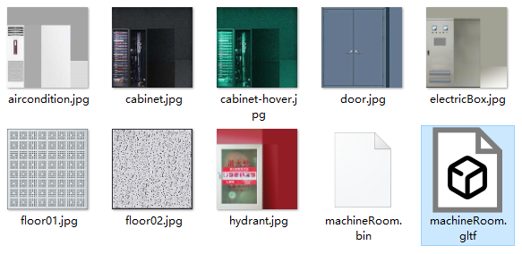

#### 1-4-规范模型的结构和命名

在建模软件中，同一类型的模型文件可以放入一个数组里，数组可以多层嵌套。

当前的机房模型比较简单，我就没有使用数组，所有的Mesh对象都是平展开的。

为了便于访问和区分模型，需要对模型进行规范命名，如机房中的IT机柜都是按照cabinet-001、cabinet-002、cabinet-003 命名的。

假设IT机柜的名称都是唯一的，那我们便可以基于这个名称从后端获取相应机柜的详细信息。

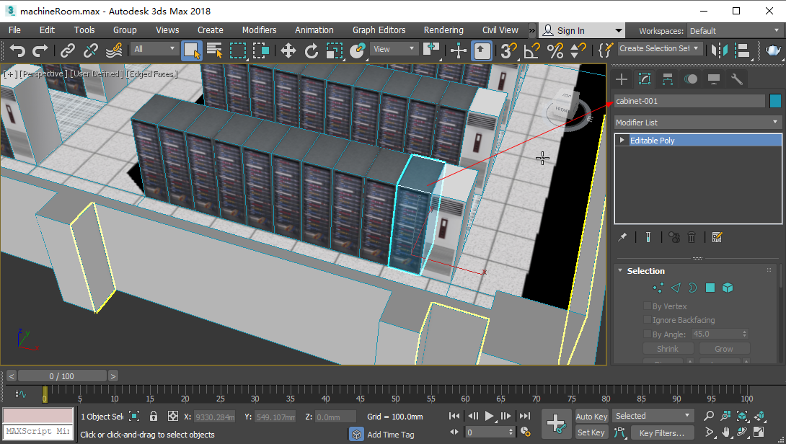


### 2-构建项目

1.使用create-react-app 构建项目

Create React App 是React 官方支持的创建单页应用程序的工具，使用它可以快速构建一个react 项目。 

```js
npx create-react-app 02-machineroom --template typescript
```

官方链接：https://create-react-app.bootcss.com/docs/getting-started


2.运行项目，package.json 里已经提供了start开发模式、build生产模式、test测试模式等。

我们可以先使用开发模式运行项目：

```
npm run start
```

页面效果如下：

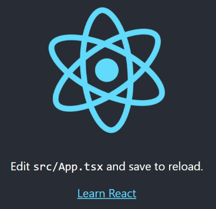


3.安装three 相关的依赖

```js
npm install three @types/three --save
```


4.调整一下ts的配置文件，取消strict 模式。因为如果strict为true，用threejs 写程序时，会比较麻烦。

tsconfig.json

```js
{
  "compilerOptions": {
    ……
    // "strict": true,
    ……
  },
  ……
}
```


5.调整index.tsx首页，我们现在先不考虑项目测试，所以其中有些东西可以删掉，最终首页代码如下：

```
import React from 'react';
import ReactDOM from 'react-dom';
import './index.css';
import App from './App';

ReactDOM.render(
  <React.StrictMode>
    <App />
  </React.StrictMode>,
  document.getElementById('root')
);

```

注：

- 当前的vscode编辑器还无法对tsx 文件做格式化，可以安装一个Prettier - Code formatter 插件。

- react 18 对react 做了更新，index.tsx需要这样写：

```js
import { createRoot } from "react-dom/client";
import "./index.css";
import App from "./App";

const container = document.getElementById("root");
const root = createRoot(container);
root.render(<App />);
```

详情参考官方链接：https://reactjs.org/blog/2022/03/08/react-18-upgrade-guide.html#updates-to-client-rendering-apis


6.在src 文件夹里建立一个models 文件夹，将之前的模型文件放进去。同理，在public文件夹里放一份。


7.在App.tsx中建立canvas画布。

- App.tsx

```tsx
import React from 'react';
import './App.css';
 
class App extends React.Component {
  // 建立canvas 画布
  render() {
    return <div className="App">
      <canvas id='canvas'></canvas>
    </div>
  }
}

export default App;

```


8.设置css样式，让App组件充满窗口。

- index.css

```css
html{
  height: 100%;
}
body{
  height: 100%;
  margin: 0;
}
#root{
  height: 100%;
}
```

- App.css

```css
.App {
  height: 100%;
  overflow: hidden;
}
```


### 3-建立机房对象-MachineRoom.ts

机房对象会把所有图形相关的对象都封装进去，对模型进行统一管理和渲染。

src/component/MachineRoom.ts

```tsx
import {
  MeshBasicMaterial,MeshStandardMaterial,
  Mesh, PerspectiveCamera,Raycaster,
  Scene,Texture,TextureLoader,
  WebGLRenderer, Vector2
} from 'three'
import { OrbitControls } from 'three/examples/jsm/controls/OrbitControls'
import { GLTFLoader } from 'three/examples/jsm/loaders/GLTFLoader'

// GLTF 模型加载器
const gltfLoader=new GLTFLoader()

export default class MachineRoom{
  // 渲染器
  renderer: WebGLRenderer
  // 场景
  scene: Scene
  // 相机
  camera: PerspectiveCamera
  // 轨道控制器
  controls: OrbitControls
  // 存放模型文件的目录
  modelPath: string
  
  // 初始化场景
  constructor(canvas: HTMLCanvasElement,modelPath: string = './models/') {
    this.renderer = new WebGLRenderer({ canvas })
    this.scene=new Scene()
    this.camera = new PerspectiveCamera(
      45, canvas.width / canvas.height, 0.1, 1000
    )
    this.camera.position.set(0, 10, 15)
    this.camera.lookAt(0, 0, 0)
    this.controls = new OrbitControls(
      this.camera,
      this.renderer.domElement
    );
    this.modelPath=modelPath
  }
  
  // 加载GLTF模型
  loadGLTF(modelName: string = '') {
    gltfLoader.load(this.modelPath + modelName, ({ scene: { children } }) => {
      this.scene.add(...children);
    })
  }
 
  // 连续渲染
  animate() {
    this.renderer.render(this.scene, this.camera)
    requestAnimationFrame(() => {
      this.animate()
    })
  }
}
```


### 4-实例化机房对象

- App.tsx

```jsx
import React from 'react';
import './App.css';
import MachineRoom from './component/MachineRoom'

//机房对象
let room: MachineRoom
//canvas画布
let canvas:HTMLCanvasElement
 
class App extends React.Component {
   
  componentDidMount() {
    if (!canvas) { return }
    canvas.width = window.innerWidth
    canvas.height = window.innerHeight
    room=new MachineRoom(canvas)
    room.loadGLTF('machineRoom.gltf')
    room.animate()
  }
  // 建立canvas 画布，并通过ref 获取其HTMLCanvasElement对象
  render() {
    return <div className="App">
      <canvas
        id='canvas'
        ref={ele => canvas = ele}
      ></canvas>
    </div>
  }
}

export default App;
```

终效果如下：

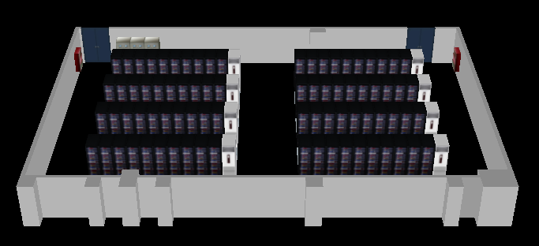


现在，我们已经完成了GLTF 模型的导入、渲染和相机变换。

然而，把这个图和之前的3dsmax 图片对比一下，就会发现一个问题：three里的贴图颜色变深了。


接下来咱们分析一下这个问题。


### 5-调整模型数据

#### 5-1-问题分析

在机房对象里打印模型

```js
loadGLTF(modelName: string = '') {
  gltfLoader.load(this.modelPath + modelName, ({ scene: { children } }) => {
    console.log(...children);:
    this.scene.add(...children);
  })
}
```

分析一下children里的Mesh 对象，可以发现：所有Mesh对象的material材质都是MeshStandardMaterial 类型。

再分析一下material 中的map 贴图，可以发现其map贴图为 Texture  对象，其具备以下重要信息：

- name 是贴图图片的名称。
- flipY为false，即不对图像的y轴做翻转。
- image图像源是ImageBitmap 类型。
- wrapS 纹理横向重复，即THREE.RepeatWrapping。
- wrapT 纹理纵向重复，即THREE.RepeatWrapping。

注：THREE.RepeatWrapping=1000

在此，我们要知道以下threejs 知识：

- MeshStandardMaterial 材质会感光，这不是我们所需要的，我们不需要打光，需要将其材质换成MeshBasicMaterial。
- ImageBitmap 的图像类型是渲染效果变黑的关键原因，因此需要将其换成Image() 对象。

接下来咱们就给模型换一个材质和图像源。


#### 5-2-修改材质和图像源

1.为机房对象添加maps属性，用来存储纹理对象，以避免贴图的重复加载。

```jsx
maps: Map<string, Texture>=new Map()
```


2.在加载GLTF 的时候，用changeMat()方法修改Mesh 对象的材质

```js
loadGLTF(modelName: string = '') {
  gltfLoader.load(this.modelPath+modelName, ({ scene: { children } }) => {
    children.forEach((obj:Mesh) => {
      const { map,color} = obj.material as MeshStandardMaterial
      this.changeMat(obj,map,color)
    })
  })
}
```


3.为机房对象中添加一个修改材质的方法changeMat()

```js
changeMat(obj: Mesh, map: Texture, color: Color) {
  if (map) {
    obj.material = new MeshBasicMaterial({
      map: this.crtTexture(map.name)
    })
  } else {
    obj.material = new MeshBasicMaterial({color})
  }
}
```

changeMat() 方法的参数：

- obj：需要修改材质的Mesh 对象
- map：GLTF 模型里的贴图对象
- color：GLTF 模型的颜色

其中的if 逻辑是：若Mesh模型有贴图，就为其换一个材质和贴图；否则，就换一个材质，并继承原GLTF 模型的颜色。


4.为机房对象添加建立纹理对象的方法crtTexture() 。

```js
crtTexture(imgName: string) {
  let curTexture=this.maps.get(imgName)
  if (!curTexture) {
    curTexture=new TextureLoader().load(this.modelPath+imgName)
    curTexture.flipY = false
    curTexture.wrapS = 1000
    curTexture.wrapT = 1000
    this.maps.set(
      imgName,
      curTexture
    )
  }
  return curTexture
}
```

crtTexture() 会根据贴图名称建立Texture 纹理对象。

- TextureLoader().load() 可以根据贴图路径，加载贴图，返回一个Texture 对象。
- curTexture 的flipY、wrapS、wrapT是对原始GLTF 贴图的相应属性的继承。

渲染效果：

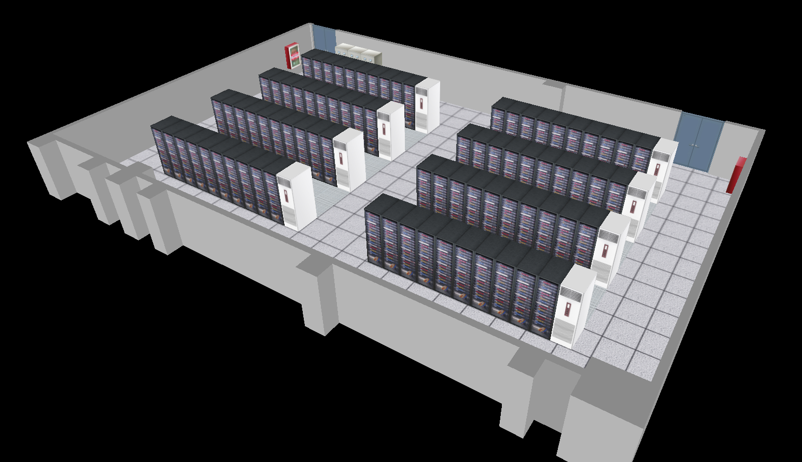

这样就和3dsmax中的模型效果一致了。

接下来，咱们再对IT 机柜做选择，让选中的机柜高亮，并提示其详细信息。


### 6-模型选择

1.为机房对象添加两个属性、三个鼠标事件

```jsx
//机柜集合
cabinets: Mesh[] = []
//鼠标划入的机柜
curCabinet:Mesh
//鼠标划入机柜事件，参数为机柜对象
onMouseOverCabinet = (cabinet:Mesh) => { }
//鼠标在机柜上移动的事件，参数为鼠标在canvas画布上的坐标位
onMouseMoveCabinet = (x:number,y:number) => { }
//鼠标划出机柜的事件
onMouseOutCabinet = () => { }
```


2.在构造函数中，为maps 添加一个机柜的高亮贴图。之后鼠标划入机柜时，会将其贴图更换为高亮贴图。

```jsx
  constructor(canvas: HTMLCanvasElement,modelPath: string = './models/') {
    ……
    this.crtTexture("cabinet-hover.jpg")
  }
  
```


3.在加载GLTF 模型时，若模型名称包含'cabinet'，便将其存入cabinets。

```jsx
loadGLTF(modelName: string = '') {
  this.gltfLoader.load(this.modelPath+modelName, ({ scene: { children } }) => {
    children.forEach((obj:Mesh) => {
      const {
        color, map
      } = obj.material as MeshStandardMaterial
      this.changeMat(obj,map,color)
      if (obj.name.includes('cabinet')) {
        this.cabinets.push(obj)
      }
    })
    this.scene.add(...children);
  })
}
```


4.在机房对象外面建立一个射线投射器，一个二维点，以避免在鼠标选择时机柜时重复实例化。

```js
//射线投射器，可基于鼠标点和相机，在世界坐标系内建立一条射线，用于选中模型
const raycaster = new Raycaster()
//鼠标在裁剪空间中的点位
const pointer = new Vector2()
```

注：对于基于鼠标点和相机，用射线选择模型的原理，在WebGL的“进入三维世界”的选择立方体里有详细讲解，此处不再赘述。


5.为机房对象添加选择模型的方法selectCabinet(x,y)，其参数为鼠标的canvas坐标位

```jsx
selectCabinet(x:number, y:number) {
  const {cabinets,renderer,camera,maps,curCabinet}=this
  const { width, height } = renderer.domElement

  // 鼠标的canvas坐标转裁剪坐标
  pointer.set(
    (x / width) * 2 - 1,
    -(y / height) * 2 + 1,
  )
  // 基于鼠标点的裁剪坐标位和相机设置射线投射器
  raycaster.setFromCamera(
    pointer, camera
  )
  // 选择机柜
  const intersect = raycaster.intersectObjects(cabinets)[0]
  let intersectObj=intersect?intersect.object as Mesh:null
  // 若之前已有机柜被选择，且不等于当前所选择的机柜，取消之前选择的机柜的高亮
  if (curCabinet&&curCabinet!==intersectObj) {
    const material =curCabinet.material as MeshBasicMaterial
    material.setValues({
      map: maps.get('cabinet.jpg')
    })
  }
  /* 
    若当前所选对象不为空：
      触发鼠标在机柜上移动的事件。
      若当前所选对象不等于上一次所选对象：
        更新curCabinet。
        将模型高亮。
        触发鼠标划入机柜事件。
    否则若上一次所选对象存在：
      置空curCabinet。
      触发鼠标划出机柜事件。
  */
  if (intersectObj) {
    this.onMouseMoveCabinet(x,y)
    if (intersectObj !== curCabinet) {
      this.curCabinet=intersectObj
      const material = intersectObj.material as MeshBasicMaterial
      material.setValues({
        map: maps.get('cabinet-hover.jpg')
      })
      this.onMouseOverCabinet(intersectObj)
    }
  } else if(curCabinet) {
    this.curCabinet = null
    this.onMouseOutCabinet()
  }
}
```


6.在App.tsx 文件中，为APP 组件添加鼠标移动事件。

```tsx
class App extends React.Component {
  ……
  // 鼠标移动事件
  mouseMove({clientX,clientY}) {
    room.selectCabinet(clientX, clientY)
  }
  // 建立canvas 画布，并通过ref 获取其HTMLCanvasElement对象
  render() {
    return <div className="App" onMouseMove={this.mouseMove}>
      ……
    </div>
  }
}
```

现在当前鼠标划入IT机柜时，便会看到如下效果：


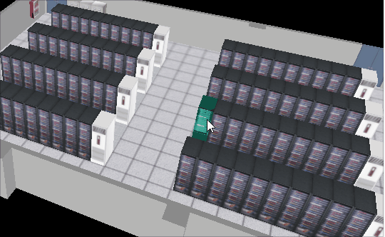


### 7-信息提示

接下来我想在鼠标划入IT机柜的时候，提示机柜的详细信息。

其最简单的做法就是用HTML 建立一个信息面板，当鼠标在IT机柜上移动的时候，就让其随鼠标移动。

1.建立信息提示板

- app.tsx

```tsx
class App extends React.Component {
  state = {
  	//信息面板的位置
    planePos: {
      left: 0,
      top:0
    },
    //信息面板的可见性
    planeDisplay: 'none',
    //机柜信息
    curCabinet: {
    	//名称
      name:'Loading……',
      //温度
      temperature: 0,
      //容量
      capacity: 0,
      //服务器数量
      count:0
    }
  }
  ……
  render() {
    const {
      planePos: { left, top },
      planeDisplay: display,
      curCabinet:{name,temperature,capacity,count}
    } = this.state
    return <div className="App" onMouseMove={this.mouseMove}>
      <canvas
        id='canvas'
        ref={ele => canvas = ele}
      ></canvas>
      <div
        id='plane'
        style={{left,top,display}}
      >
        <p>机柜名称：{name}</p>
        <p>机柜温度：{temperature}°</p>
        <p>使用情况：{count}/{capacity}</p>
      </div>
    </div>
  }
}
```

- 在App.css 文件中设置面板样式

```css
#plane{
  position: absolute;
  top: 0;
  left: 0;
  background-color: rgba(0,0,0,0.5);
  color: #fff;
  padding: 0 18px;
  transform: translate(12px,-100%);
  display: none;
}
```


2.根据绑定在机柜对象上的鼠标事件，设置信息面板的可见性和位置。

```tsx
componentDidMount() {
  if (!canvas) { return }
  canvas.width = window.innerWidth
  canvas.height = window.innerHeight
  room=new MachineRoom(canvas)
  room.modelPath='./models/'
  room.loadGLTF('machineRoom.gltf')
  room.animate()
  //当鼠标划入机柜，显示信息面板
  room.onMouseOverCabinet = () => {
    this.setState({
      planeDisplay: 'block'
    })
  }
  //当鼠标在机柜上移动，让信息面板随鼠标移动
  room.onMouseMoveCabinet = (left,top) => {
    this.setState({
      planePos: {left,top}
    })
  }
  //当鼠标划出机柜，隐藏信息面板
  room.onMouseOutCabinet = () => {
    this.setState({
      planeDisplay: 'none'
    })
  }
}
```

效果如下：

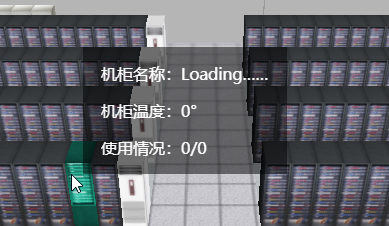

现在信息面板里的文字内容还没有随机柜变化，所以咱们接下来得说一个接口调试工具。


### 8-Apifox 接口调试

[Apifox](https://www.apifox.cn/) 是 API 文档、API 调试、API Mock、API 自动化测试一体化协作平台，定位 Postman + Swagger + Mock + JMeter。

Apifox 可以通过一套系统、一份数据，解决多个系统之间的数据同步问题。

只要定义好 API 文档，API 调试、API 数据 Mock、API 自动化测试就可以直接使用，无需再次定义。

API 文档和 API 开发调试使用同一个工具，API 调试完成后即可保证和 API 文档定义完全一致。

Apifox 可以使前后端联调更加高效、及时、准确！

Apifox 我是听大圣说的，大家可以看一下大圣在B站里[介绍Apifox 的视频](https://www.bilibili.com/video/BV13L411K7RT?spm_id_from=333.880.my_history.page.click)。

我这里就不再具体去讲Apifox了，咱们用到啥说啥。

1.在官网首页下载Apifox。

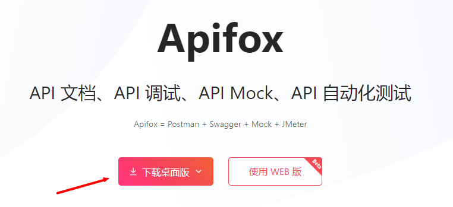

2.安装完成Apifox后，便可以看到其自带的示例项目。

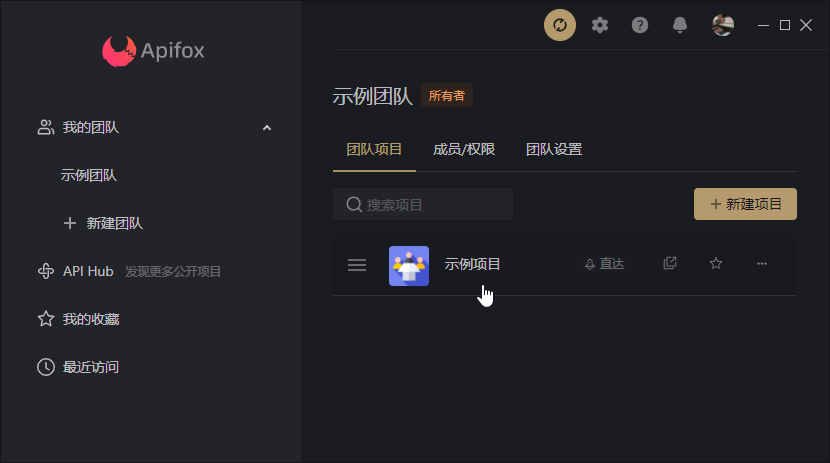


3.我们可以进入示例项目，参照其提供的例子，自己添加一个接口。

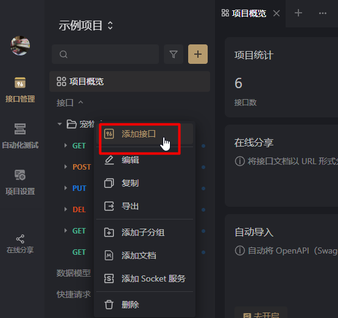


4.参考示例项目写一个根据IT机柜名获取机柜信息的接口。

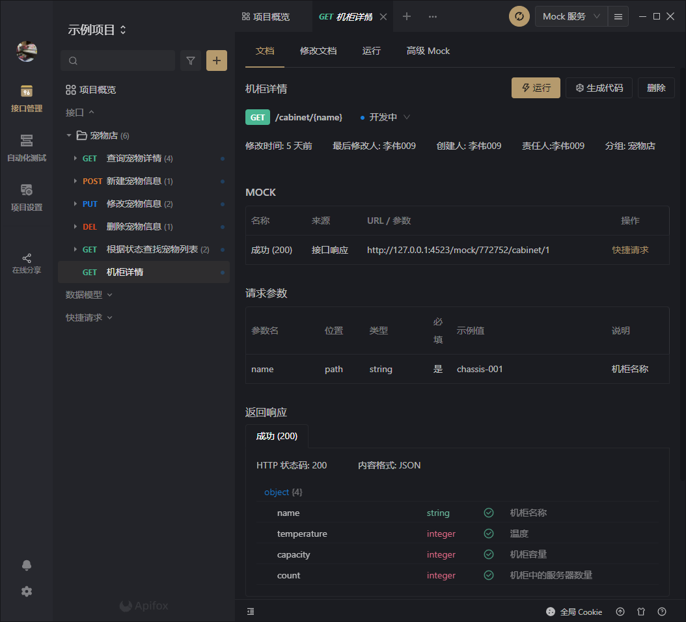


5.写完后，点击运行按钮，即可调用根据IT机柜名获取机柜信息的接口： http://127.0.0.1:4523/mock/772752/cabinet/{name} 


### 9-设置机柜信息面板的内容

1.建立一个向Apifox 接口请求机柜信息的方法。

- src/server/Cabinet.ts

```js
const path = "http://127.0.0.1:4523/mock/772752/cabinet/";
function getCabinateByName(name: string) {
  return fetch(path + name).then((res) => res.json());
}
export { getCabinateByName };
```


2.当鼠标划入IT机柜时，根据机柜名请求机柜数据，更新相应的state。

```jsx
import { getCabinateByName } from "./server/Cabinet";

class App extends React.Component {
  componentDidMount() {
    ……
    room.onMouseOverCabinet = ({ name }) => {
      ……
      //基于cabinet.name 获取机柜数据
      getCabinateByName(name).then(({ temperature, capacity, count }) => {
        this.setState({
          curCabinet: { name, temperature, capacity, count },
        });
      });
    };
    ……
  }
}

```

效果如下：


## 总结

通过三维机房的案例，我给大家分享一个我自己在实战中的经验：图形组件与前端页面的分离。

在这个案例里，我们可以看出，其最核心部分，就是三维机房对象MachineRoom。

MachineRoom 就是图形组件，它有两种职责：

- 提供与图形相关的操作，比如场景搭建，模型加载，模型选择，场景渲染等。
- 提供与前端交互的接口，比如鼠标在机柜上的划入、划出和移动事件。

图形组件尽量不要参与前端的业务逻辑，比如参与前端数据解析和存储，参与前端DOM元素的交互操作……

图形组件与前端页面的分离，会带来以下好处：

- 可以明确WebGL工程师与react、vue等主流前端工程师的分工。

  由于图形学的水很深，当我们专心于图形学的学习时，短时间内，往往会忽略对react、vue等主流框架的研究。

  图形组件与前端页面的分离，可以让我们专精与我们擅长的领域。在项目开发的时候，我们只需要与主流前端工程师做好接口对接就好。

- 降低图形组件与前端业务逻辑的耦合度，降低前端业务需求的频繁修改对图形组件的影响。

  有些大厂，涉及的业务逻辑复杂了，频繁改需求、改数据结构、改接口都是很正常的，若图形组件与前端业务逻辑混为一体，那WebGL工程师的工作就会很焦灼。

WebGL工程师与react、vue等主流前端工程师有了明确分工之后，便需要考虑团队协作。

现在在大厂里，一般主流的前端工程师比较好找，而有结实的图形学基础和实战经验的WebGL工程师却很难找。

所以，在一个以三维图形为主导的项目中，一个优秀的WebGL工程师会有很高的话语权，甚至可以让整个前端、后端都围绕他转。

不过，若WebGL工程师不精通项目工程化、不精通主流前端框架，建议不要主导整个项目的开发，也不要承担下自己不擅长的东西，只要一心一意的做好自己擅长的图形组件，与团队做好交流沟通即可。这样既省心，又省力。

关于图形组件与前端页面的分离，咱们就说到这。

后面，我们还可以一键显示机房中过热的机柜，这个原理和机柜的高亮是一样的，为其换一个偏红色调的贴图即可。大家可以自己在课后练习一下，我就不再赘述了，有问题可以在群里说。

当前这个案例主要是让大家对three实战项目有一个系统的认知。

根据不同的项目需求，我们可能还会对三维项目有不同的要求。

比如，若是我们用这种渲染三维机房的方式渲染室内设计，然后把效果图拿给业主看，那这单子肯定会搞砸了。

这是因为这种三维机房的渲染效果还是太假了。

因此，我们要不要让一个三维项目渲染得更加逼真，还是要看项目需求的。

比如这个三维机房，更多的是示意性的，若是将其整得太逼真，让它实时光线追踪，那交互起来就可能会卡。

若只是想渲染一张效果图给业主看，那咱们就得全心全意多花点时间，把一帧渲好了就行。

关于三维机房的实战，咱们就说到这。

接下来，我会系统讲解threejs 知识，告诉大家如何用three 应对不同的项目需求。


