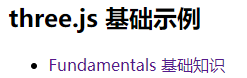

## 前言

### 课件地址

https://github.com/buglas/threejs-lesson


### 课堂目标  

- 理解three.js 的渲染结构
- 对canvas 进行响应式布局
- 让canvas 画布自适应设备分辨率


### 知识点  

- three.js 的渲染结构
- canvas 画布的css尺寸和像素尺寸
- 显示器的分辨率


## 第一章 three.js 的渲染结构

### 1-概述

之前我们在入门的时候，对three.js 的渲染过程做了一个简单演示，接下来我们对这个渲染过程做一个详细解释。

Three.js 封装了场景、灯光、阴影、材质、纹理和三维算法，让你不必再直接用WebGL 开发项目。

当然，我刚才说的是“不必再直接用WebGL”，有的时候我们会间接用到WebGL，比如自定义着色器。

three.js 在渲染三维场景时，需要创建很多对象，并将它们关联在一起。

下图便是一个基本的three.js 渲染结构。  

  

 

解释一下上面的示意图：

- Renderer 渲染器

  Renderer 是three.js 的主要对象。当你将一个场景Scene 和一个摄像机Camera 传递到渲染器的渲染方法中，渲染器便会将摄像机视椎体中的三维场景渲染成一个二维图像显示在canvas 画布中。

- Scene 场景对象

  场景对象是树状结构的，其中包含了三维对象Object3D 和灯光对象Light。

  Object3D 是可以被直接渲染出来的，Object3D是网格对象Mesh和集合对象Group的基类。

  场景对象可以定义场景的背景色和雾效。

  在场景对象的树状结构中，每个对象的变换信息都是相对的。

  比如汽车和汽车里的人，人的位置是相对于汽车而言的，当汽车移动了，人的本地坐标位坐标位虽然不变，但其世界坐标位已经变了。相关原理我们在WebGL 的三维世界里说过。

- Camera 相机对象

  按理说，相机对象是在场景里的，但是相机对象不在它所看的场景里，这就像我们自己看不见自己的眼睛一样。

  因此，相机对象可以独立于场景之外。

  相机对象是可以作为其它三维对象的子对象的，这样相机就会随其父对象同步变换。

- Mesh 网格对象

  网格对象由几何体Geometry和材质Material两部分组成，Geometry 负责塑形，Material 负责着色。

  Geometry 和Materia 是可以被多个Mesh 对象复用的。

  比如要绘制两个一模一样的立方体，那只需要实例化两个Mesh 即可，Geometry 和Materia可以使用一套。

- Geometry 几何体对象

  几何体对象负责塑形，存储了与顶点相关的数据，比如顶点点位、顶点索引、uv坐标等。

  Three.js 中内置了许多基本几何体，我们也可以自定义几何体，或者从外部的模型文件里加载几何体

- Material 材质对象

  材质对象负责着色，绘制几何体的表面属性，比如漫反射、镜面反射、光泽度、凹凸等。

  材质对象的许多属性都可以用纹理贴图表示，比如漫反射贴图、凹凸贴图等。

- Texture 纹理对象

  纹理对象就是一张图像。纹理图像的图像源可以是Image 图片、canvas 画布、Video 视频等。

- Light 光源对象

  Light 对象不像Object3D 那样依托于顶点，它更多的是像Object3D 里的材质Material 那样，作用于物体的样式。

  Light 对象可以理解为在为几何体添加了材质后，再利用光效配合材质对几何体的样式进行二次加工。

我们可以结合入门时绘制的立方体，来理解上面的示意图。


### 2-示例-绘制多个立方体

我们入门时绘制过一个立方体：


其渲染结构如下：


接下来咱们基于这个例子，练习一下之前说过渲染结构。

为了让对react+ts 不太熟练的同学更好的适应react+ts，咱们把之前的例子导入react 中。

1.搭建react+ts 项目

```
npx create-react-app 03-basics --template typescript
```

react+ts 的用法可参考此链接： https://react-typescript-cheatsheet.netlify.app/docs/basic/setup


2.在react 项目中安装three依赖

```
npm install three @types/three --save
```


3.在react 项目中安装路由，路由版本是react-router-v6

```
npm install react-router@6 react-router-dom@6 --save
```

react-router-v6 的用法可参考此链接：https://juejin.cn/post/7088526716049555492


4.在index.tsx 中，必须用路由组件包裹APP。 

- index.tsx

```tsx
import { BrowserRouter } from "react-router-dom";
import { createRoot } from "react-dom/client";
import App from "./App";

const container = document.getElementById("root") as HTMLElement;
const root = createRoot(container);
root.render(
  <BrowserRouter>
    <App />
  </BrowserRouter>
);
```


 5.构建项目页面

- src/view/Basics.tsx

```tsx
import React from "react";

const Basics: React.FC = (): JSX.Element => {
  return (
    <nav style={{ width: "60%", margin: "auto" }}>
      <h2>three.js 基础示例</h2>
    </nav>
  );
};

export default Basics;
```


- src/view/RenderStructure.tsx

```tsx
import React from "react";

const RenderStructure: React.FC = (): JSX.Element => {
  return <div>RenderStructure 渲染结构</div>;
};

export default RenderStructure;
```


 5.用React Router v6 提供的useRoutes hook 搭建路由。 

- App.tsx

```tsx
import React from "react";
import { useRoutes } from "react-router-dom";
import "./App.css";
import Basics from "./view/Basics";
import RenderStructure from "./view/RenderStructure";

const App: React.FC = (): JSX.Element => {
  const routing = useRoutes([
    {
      path: "/",
      element: <Basics />,
    },
    {
      path: "RenderStructure",
      element: <RenderStructure />,
  ]);
  return <>{routing}</>;
};

export default App;

```

之后我们说其它知识的时候，还会再添加新的router。


6.在首页Basics.tsx 中建立导航栏，用Link 组件实现页面跳转。 

- src/view/Basics.tsx

```tsx
import React from "react";
import { Link } from "react-router-dom";

const Basics: React.FC = (): JSX.Element => {
  return (
    <nav style={{ width: "60%", margin: "auto" }}>
      <h2>three.js 基础示例</h2>
      <ul>
        <li>
        	<Link to="/RenderStructure">RenderStructure 渲染结构</Link>
        </li>
      </ul>
    </nav>
  );
};

export default Basics;
```

首页效果如下：




7.在RenderStructure.tsx 页面导入之前的立方体项目。

- src/view/RenderStructure.tsx

```tsx
import React, { useRef, useEffect } from "react";
import { BoxGeometry, DirectionalLight, Mesh, MeshNormalMaterial, MeshPhongMaterial, PerspectiveCamera, Scene, WebGLRenderer } from "three";

const { innerWidth, innerHeight } = window;

const scene = new Scene();
const camera = new PerspectiveCamera(75, innerWidth / innerHeight, 0.1, 1000);
camera.position.z = 5;

const renderer = new WebGLRenderer();
renderer.setSize(innerWidth, innerHeight);

const geometry = new BoxGeometry();
const material = new MeshNormalMaterial();
const cube = new Mesh(geometry, material);
scene.add(cube);

function animate() {
  requestAnimationFrame(animate);
  cube.rotation.x += 0.01;
  cube.rotation.y += 0.01;
  renderer.render(scene, camera);
}

const RenderStructure: React.FC = (): JSX.Element => {
  const divRef = useRef<HTMLDivElement>(null);
  useEffect(() => {
    const { current } = divRef;
    if (current) {
      current.innerHTML = "";
      current.append(renderer.domElement);
      animate();
    }
    
  }, []);
  return <div ref={divRef}></div>;
};

export default RenderStructure;
```

在上面的代码中，我没有直接建立<canvas> ，而是在WebGLRenderer 对象的实例化方法里建立的，在其源码可以找到相关逻辑：

```js
function WebGLRenderer( parameters = {} ) {
	const _canvas = parameters.canvas !== undefined ? parameters.canvas : createCanvasElement()
	……
  this.domElement = _canvas;
  ……
}
```

通过WebGLRenderer 对象建立了canvas后，再在react的函数组件的useEffect hook 中，将canvas 添加到div 中。

```jsx
const RenderStructure: React.FC = (): JSX.Element => {
  const divRef = useRef<HTMLDivElement>(null);
  useEffect(() => {
    const { current } = divRef;
    current && current.append(renderer.domElement);
    animate();
  }, []);
  return <div ref={divRef}></div>;
};
```

当前这个立方体的材质是MeshNormalMaterial，并不受光照影响。


8.给立方体换个MeshPhongMaterial 材质，再添加光源。

```tsx
const geometry = new BoxGeometry();
const material = new MeshPhongMaterial({ color: 0x44aa88 });
const cube = new Mesh(geometry, material);
scene.add(cube);

const color = 0xffffff;
const intensity = 1;
const light = new DirectionalLight(color, intensity);
light.position.set(-1, 2, 4);
scene.add(light);
```

当前的渲染结构如下：

 

效果如下：


9.在场景中再添加两个一模一样的立方体，演示几何体和材质可被多个Mesh 对象共享。

```tsx
const geometry = new BoxGeometry();
const material = new MeshPhongMaterial({ color: 0x44aa88 });

const cubes = [-2, 0, 2].map((num) => makeInstance(num));
scene.add(...cubes);

function makeInstance(x: number) {
  const cube = new Mesh(geometry, material);
  cube.position.x = x;
  return cube;
}

function animate() {
  requestAnimationFrame(animate);

  cubes.forEach((cube) => {
    cube.rotation.x += 0.01;
    cube.rotation.y += 0.01;
  });

  renderer.render(scene, camera);
}
```

当前的渲染结构如下：


效果如下：


关于three.js 的渲染结构咱们就说到这，接下来，咱们说一下three.js 的响应式设计。


