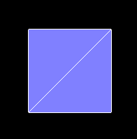

## 前言

### 课件地址

https://github.com/buglas/threejs-lesson


### 课堂目标  

- 认识three.js 提供的内置几何体
- 自定义几何体


### 知识点  

- 内置几何体
- 自定义几何体
- 几何体顶点数据的读写


## 1-内置几何体

three.js 的内置几何体大致可分成以下几类：

- 二维几何体
  - PlaneGeometry 矩形平面
  - CircleGeometry 圆形平面
  - RingGeometry 圆环平面
  - ShapeGeometry 二维图形
- 三维几何体
  - BoxGeometry 立方体
  - TetrahedronGeometry 四面体
  - OctahedronGeometry 八面体
  - DodecahedronGeometry  十二面体 
  - IcosahedronGeometry 二十面体
  - PolyhedronGeometry 多面体
  - SphereGeometry 球体
  - ConeGeometry  圆锥
  - CylinderGeometry 圆柱
  - TorusGeometry 三维圆环
  - TorusKnotGeometry 扭结
- 路径合成几何体
  - TubeGeometry 管道
  - LatheGeometry 车削
  - ExtrudeGeometry 挤压
- 线性几何体
  - WireframeGeometry 网格几何体
  - EdgesGeometry 边缘几何体

接下来，咱们详细说一下其绘制方法。


### 1-1-二维几何体

#### PlaneGeometry 矩形平面



PlaneGeometry(width : Float, height : Float, widthSegments : Integer, heightSegments : Integer)

- width — 平面沿着X轴的宽度。默认值是1。
- height — 平面沿着Y轴的高度。默认值是1。
- widthSegments — （可选）平面的宽度分段数，默认值是1。
- heightSegments — （可选）平面的高度分段数，默认值是1。

代码实例：

1.先参照上一篇的项目架构一个一个react+ts 项目，详情参见源码。

2.建立一个Stage对象，把渲染器、场景、相机、轨道控制器和响应式布局都封装进去。这样在写例子的时候会比较方便、整洁。

- src/component/Stage.ts

```tsx
import { PerspectiveCamera, Scene, WebGLRenderer } from "three";
import { OrbitControls } from "three/examples/jsm/controls/OrbitControls";

export default class Stage {
  // 渲染器
  renderer: WebGLRenderer;
  // 场景
  scene: Scene;
  // 相机
  camera: PerspectiveCamera;
  // 轨道控制器
  controls: OrbitControls;
  // 渲染之前
  beforeRender = (time: number = 0) => {};

  // 初始化场景
  constructor(x: number = 0, y: number = 0, z: number = 12) {
    this.scene = new Scene();
    this.renderer = new WebGLRenderer({ antialias: true });
    const { clientWidth, clientHeight } = this.renderer.domElement;
    this.renderer.setSize(clientWidth * devicePixelRatio, clientHeight * devicePixelRatio, false);
    this.camera = new PerspectiveCamera(45, clientWidth / clientHeight, 0.1, 1000);
    this.camera.position.set(x, y, z);
    this.camera.lookAt(0, 0, 0);
    this.controls = new OrbitControls(this.camera, this.renderer.domElement);
  }

  // 响应式布局
  responsive() {
    const { renderer, camera } = this;
    if (this.resizeRendererToDisplaySize(renderer)) {
      const { clientWidth, clientHeight } = renderer.domElement;
      camera.aspect = clientWidth / clientHeight;
      camera.updateProjectionMatrix();
    }
  }

  // 重置渲染尺寸
  resizeRendererToDisplaySize(renderer: WebGLRenderer): boolean {
    const { width, height, clientWidth, clientHeight } = renderer.domElement;
    const [w, h] = [clientWidth * devicePixelRatio, clientHeight * devicePixelRatio];
    const needResize = width !== w || height !== h;
    if (needResize) {
      renderer.setSize(w, h, false);
    }
    return needResize;
  }

  // 连续渲染
  animate(time = 0) {
    this.responsive();
    this.beforeRender(time);
    this.renderer.render(this.scene, this.camera);
    requestAnimationFrame((time) => {
      this.animate(time);
    });
  }
}
```


3.绘制矩形平面。

- src/component/Plane.ts

```tsx
import React, { useRef, useEffect } from "react";
import {
  Mesh,
  MeshBasicMaterial,
  MeshNormalMaterial,
  PlaneGeometry,
} from "three";
import Stage from "../component/Stage";
import "./fullScreen.css";

const stage = new Stage();
const { scene, renderer } = stage;

const geometry = new PlaneGeometry();

{
  const material = new MeshNormalMaterial({
    polygonOffset: true,
    polygonOffsetFactor: 1,
    polygonOffsetUnits: 1,
  });
  const mesh = new Mesh(geometry, material);
  scene.add(mesh);
}
{
  const material = new MeshBasicMaterial({
    wireframe: true,
  });
  const mesh = new Mesh(geometry, material);
  scene.add(mesh);
}

const Plane: React.FC = (): JSX.Element => {
  const divRef = useRef<HTMLDivElement>(null);
  useEffect(() => {
    const { current } = divRef;
    if (current) {
      current.innerHTML = "";
      current.append(renderer.domElement);
      stage.animate();
    }
  }, []);
  return <div ref={divRef} className="canvasWrapper"></div>;
};

export default Plane;
```


#### CircleGeometry 圆形平面


CircleGeometry(radius : Float, segments : Integer, thetaStart : Float, thetaLength : Float)

- radius — 圆形的半径，默认值为1
- segments — 分段（三角面）的数量，最小值为3，默认值为8。
- thetaStart — 第一个分段的起始角度，默认为0。（three o'clock position）
- thetaLength — 圆形扇区的中心角，通常被称为“θ”（西塔）。默认值是2*Pi，这使其成为一个完整的圆。


#### RingGeometry 圆环平面


RingGeometry(innerRadius : Float, outerRadius : Float, thetaSegments : Integer, phiSegments : Integer, thetaStart : Float, thetaLength : Float)

- innerRadius — 内部半径，默认值为0.5。
- outerRadius — 外部半径，默认值为1。
- thetaSegments — 圆环的分段数。这个值越大，圆环就越圆。最小值为3，默认值为8。
- phiSegments — 最小值为1，默认值为8。
- thetaStart — 起始角度，默认值为0。
- thetaLength — 圆心角，默认值为Math.PI * 2。


#### ShapeGeometry 二维图形

ShapeGeometry(shapes : Array, curveSegments : Integer)

- shapes — 一个单独的shape，或者一个包含形状的Array。
- curveSegments - Integer - 每一个形状的分段数，默认值为12。

代码示例：

```js
const shape = new Shape();
shape.moveTo(0, 0);
shape.bezierCurveTo(1, 1, -1, 1, 0, 0);
const geometry = new ShapeGeometry(shape);
```

效果如下：


### 1-2-三维几何体

#### BoxGeometry 立方体


BoxGeometry(width : Float, height : Float, depth : Float, widthSegments : Integer, heightSegments : Integer, depthSegments : Integer)

- width — X轴上面的宽度，默认值为1。
- height — Y轴上面的高度，默认值为1。
- depth — Z轴上面的深度，默认值为1。
- widthSegments — （可选）宽度的分段数，默认值是1。
- heightSegments — （可选）高度的分段数，默认值是1。
- depthSegments — （可选）深度的分段数，默认值是1。


#### TetrahedronGeometry 四面体


TetrahedronGeometry(radius : Float, detail : Integer)

- radius — 四面体的半径，默认值为1。
- detail — 默认值为0。将这个值设为一个大于0的数将会为它增加一些顶点，使其不再是一个四面体。


#### OctahedronGeometry 八面体


OctahedronGeometry(radius : Float, detail : Integer)

- radius — 八面体的半径，默认值为1。
- detail — 默认值为0，将这个值设为一个大于0的数将会为它增加一些顶点，使其不再是一个八面体。


#### DodecahedronGeometry  十二面体 


DodecahedronGeometry(radius : Float, detail : Integer)

- radius — 十二面体的半径，默认值为1。
- detail — 默认值为0。将这个值设为一个大于0的数将会为它增加一些顶点，使其不再是一个十二面体。


#### IcosahedronGeometry 二十面体


IcosahedronGeometry(radius : Float, detail : Integer)

- radius — 二十面体的半径，默认为1。
- detail — 默认值为0。将这个值设为一个大于0的数将会为它增加一些顶点，使其不再是一个二十面体。当这个值大于1的时候，实际上它将变成一个球体。


#### PolyhedronGeometry 多面体

PolyhedronGeometry(vertices : Array, indices : Array, radius : Float, detail : Integer

- vertices — 一个顶点Array（数组）：[1,1,1, -1,-1,-1, ... ]。
- indices — 一个构成面的索引Array（数组）， [0,1,2, 2,3,0, ... ]。
- radius — Float - 最终形状的半径。
- detail — Integer - 将对这个几何体细分多少个级别。细节越多，形状就越平滑。

代码示例：

```js
const geometry = new PolyhedronGeometry(
  [-1, -1, -1, 1, -1, -1, 1, 1, -1, -1, 1, -1, -1, -1, 1, 1, -1, 1, 1, 1, 1, -1, 1, 1],
  [2, 1, 0, 0, 3, 2, 0, 4, 7, 7, 3, 0, 0, 1, 5, 5, 4, 0, 1, 2, 6, 6, 5, 1, 2, 3, 7, 7, 6, 2, 4, 5, 6, 6, 7, 4],
  1,
  1
);
```

效果如下：


#### SphereGeometry 球体


SphereGeometry(radius : Float, widthSegments : Integer, heightSegments : Integer, phiStart : Float, phiLength : Float, thetaStart : Float, thetaLength : Float)

- radius — 球体半径，默认为1。
- widthSegments — 水平分段数（沿着经线分段），最小值为3，默认值为32。
- heightSegments — 垂直分段数（沿着纬线分段），最小值为2，默认值为16。
- phiStart — 指定水平（经线）起始角度，默认值为0。。
- phiLength — 指定水平（经线）扫描角度的大小，默认值为 Math.PI * 2。
- thetaStart — 指定垂直（纬线）起始角度，默认值为0。
- thetaLength — 指定垂直（纬线）扫描角度大小，默认值为 Math.PI。

该几何体是通过扫描并计算围绕着Y轴（水平扫描）和X轴（垂直扫描）的顶点来创建的。 

因此，我们可以通过为phiStart，phiLength，thetaStart和thetaLength属性对球体进行切片。


#### ConeGeometry  圆锥


ConeGeometry(radius : Float, height : Float, radialSegments : Integer, heightSegments : Integer, openEnded : Boolean, thetaStart : Float, thetaLength : Float)

- radius — 圆锥底部的半径，默认值为1。
- height — 圆锥的高度，默认值为1。
- radialSegments — 圆锥侧面周围的分段数，默认为8。
- heightSegments — 圆锥侧面沿着其高度的分段数，默认值为1。
- openEnded — 一个Boolean值，指明该圆锥的底面是开放的还是封顶的。默认值为false，即其底面默认是封顶的。
- thetaStart — 第一个分段的起始角度，默认为0。（three o'clock position）
- thetaLength — 圆锥底面圆扇区的中心角，通常被称为“θ”（西塔）。默认值是2*Pi，这使其成为一个完整的圆锥。


#### CylinderGeometry 圆柱


CylinderGeometry(radiusTop : Float, radiusBottom : Float, height : Float, radialSegments : Integer, heightSegments : Integer, openEnded : Boolean, thetaStart : Float, thetaLength : Float)

- radiusTop — 圆柱的顶部半径，默认值是1。
- radiusBottom — 圆柱的底部半径，默认值是1。
- height — 圆柱的高度，默认值是1。
- radialSegments — 圆柱侧面周围的分段数，默认为8。
- heightSegments — 圆柱侧面沿着其高度的分段数，默认值为1。
- openEnded — 一个Boolean值，表示该圆柱的底面和顶面是否开放。默认值为false，即闭合。
- thetaStart — 第一个分段的起始角度，默认为0。（three o'clock position）
- thetaLength — 圆柱底面圆扇区的中心角，通常被称为“θ”（西塔）。默认值是2*Pi，这使其成为一个完整的圆柱。


#### TorusGeometry 三维圆环


TorusGeometry(radius : Float, tube : Float, radialSegments : Integer, tubularSegments : Integer, arc : Float)

- radius - 环面的半径，从环面的中心到管道横截面的中心。默认值是1。
- tube — 管道的半径，默认值为0.4。
- radialSegments — 管道横截面的分段数，默认值为8。
- tubularSegments —圆环x的分段数，默认值为6。
- arc — 圆环的圆心角（单位是弧度），默认值为Math.PI * 2。


#### TorusKnotGeometry 扭结


TorusKnotGeometry(radius : Float, tube : Float, tubularSegments : Integer, radialSegments : Integer, p : Integer, q : Integer)

radius - 圆环的半径，默认值为1。

tube — 管道的半径，默认值为0.4。

tubularSegments — 扭结线的分段数量，默认值为64。

radialSegments — 管道分段数量，默认值为8。

p — 这个值决定了几何体将绕着其旋转对称轴旋转多少次，默认值是2。

q — 这个值决定了几何体将绕着其内部圆环旋转多少次，默认值是3。


### 1-3-路径合成几何体

#### TubeGeometry 管道


TubeGeometry(path : Curve, tubularSegments : Integer, radius : Float, radialSegments : Integer, closed : Boolean)

- path — Curve - 一个由基类Curve继承而来的3D路径。 Default is a quadratic bezier curve.
- tubularSegments — Integer - 组成这一管道的分段数，默认值为64。
- radius — Float - 管道的半径，默认值为1。
- radialSegments — Integer - 管道横截面的分段数目，默认值为8。
- closed — Boolean 管道的两端是否闭合，默认值为false。

代码示例：

```tsx
class CustomSinCurve extends Curve<Vector3> {
  constructor() {
    super();
  }
  getPoint(t: number, optionalTarget: Vector3 = new Vector3()) {
    const tx = t;
    const ty = Math.cos(8 * Math.PI * t) / 8;
    const tz = Math.sin(8 * Math.PI * t) / 8;

    return optionalTarget.set(tx, ty, tz);
  }
}

const path = new CustomSinCurve();
const geometry = new TubeGeometry(path, 64, 0.05, 8);
```


#### LatheGeometry 车削


LatheGeometry(points : Array, segments : Integer, phiStart : Float, phiLength : Float)

- points — 一个Vector2对象数组。每个点的X坐标必须大于0。 
- segments — 要生成的车削几何体圆周分段的数量，默认值是12。
- phiStart — 以弧度表示的起始角度，默认值为0。
- phiLength — 车削部分的弧度（0-2PI）范围，2PI将是一个完全闭合的、完整的车削几何体，小于2PI是部分的车削。默认值是2PI。

代码示例：

```tsx
const points = [];
for (let i = 0; i < 1; i += 0.1) {
  const x = (Math.sin(i * Math.PI * 1.8 + 3) + 1) / 5 + 0.02;
  points.push(new Vector2(x, i));
}
const geometry = new LatheGeometry(points);
```


#### ExtrudeGeometry 挤压


ExtrudeGeometry(shapes : Array, options : Object)

- shapes — 形状或者一个包含形状的数组。
- options — 一个包含有下列参数的对象：
  - steps — int，用于沿着挤出样条的深度细分的点的数量，默认值为1。
  - depth — float，挤出的形状的深度，默认值为1。
  - bevelEnabled — bool，对挤出的形状应用是否斜角，默认值为true。
  - bevelThickness — float，设置原始形状上斜角的厚度。默认值为0.2。
  - bevelSize — float。斜角与原始形状轮廓之间的延伸距离，默认值为bevelThickness-0.1。
  - bevelOffset — float. Distance from the shape outline that the bevel starts. Default is 0.
  - bevelSegments — int。斜角的分段层数，默认值为3。
  - extrudePath — THREE.Curve对象。一条沿着被挤出形状的三维样条线。Bevels not supported for path extrusion.
  - UVGenerator — Object。提供了UV生成器函数的对象。

该对象可以将一个二维形状挤成一个三维几何体。

当使用这个几何体创建Mesh的时候，如果你希望分别对它的表面和它挤出的侧面使用单独的材质，你可以使用一个材质数组。 第一个材质将用于其表面；第二个材质则将用于其挤压出的侧面。

代码示例：

```tsx
const shape = new Shape();
shape.moveTo(0, 0);
shape.lineTo(0, 1);
shape.lineTo(1, 1);
shape.lineTo(1, 0);
shape.lineTo(0, 0);

const extrudeSettings = {
  steps: 1,
  depth: 1,
  bevelEnabled: true,
  bevelThickness: 0.2,
  bevelSize: 0.1,
  bevelOffset: 0,
  bevelSegments: 1,
};

const geometry = new ExtrudeGeometry(shape, extrudeSettings);
```


### 1-4-线性几何体

#### WireframeGeometry 网格几何体


WireframeGeometry( geometry : BufferGeometry )

- geometry — 任意几何体对象。

代码示例：

```tsx
const line = new LineSegments(wireframe);
const mat = line.material as LineBasicMaterial;
mat.depthTest = false;
mat.opacity = 0.5;
mat.transparent = true;
```


#### EdgesGeometry 边缘几何体


EdgesGeometry( geometry : BufferGeometry, thresholdAngle : Integer )

- geometry — 任何一个几何体对象。
- thresholdAngle — 仅当相邻面的法线之间的角度（单位为角度）超过这个值时，才会渲染边缘。默认值为1。

代码示例：

```tsx
const geometry = new SphereGeometry(2, 8, 8);
const edges = new EdgesGeometry(geometry);
const line = new LineSegments(edges);
```


## 2-自定义几何体

### 2-1-基本概念

BufferGeometry 是所有three.js 内置几何体的基类，通过此基类可以自定义几何体。

BufferGeometry 具备以下重要属性：

- position  顶点位置
- index 顶点索引
- normal 法线
- uv 坐标
- color 顶点颜色

 

从上图可以看出，在顶点索引为4的地方，position 、normal 、uv 、color 是基于顶点一一对应的。

接下来咱们自己自定义一个几何体。


### 2-2-自定义立方体 

1.在下面的vertices里，我们按照对立三角形的绘图方式，定义了立方体的6个面，共36个顶点。

```js
const vertices = [
  // front
  { pos: [-1, -1,  1], norm: [ 0,  0,  1], uv: [0, 0], },
  { pos: [ 1, -1,  1], norm: [ 0,  0,  1], uv: [1, 0], },
  { pos: [-1,  1,  1], norm: [ 0,  0,  1], uv: [0, 1], },
 
  { pos: [-1,  1,  1], norm: [ 0,  0,  1], uv: [0, 1], },
  { pos: [ 1, -1,  1], norm: [ 0,  0,  1], uv: [1, 0], },
  { pos: [ 1,  1,  1], norm: [ 0,  0,  1], uv: [1, 1], },
  // right
  { pos: [ 1, -1,  1], norm: [ 1,  0,  0], uv: [0, 0], },
  { pos: [ 1, -1, -1], norm: [ 1,  0,  0], uv: [1, 0], },
  { pos: [ 1,  1,  1], norm: [ 1,  0,  0], uv: [0, 1], },
 
  { pos: [ 1,  1,  1], norm: [ 1,  0,  0], uv: [0, 1], },
  { pos: [ 1, -1, -1], norm: [ 1,  0,  0], uv: [1, 0], },
  { pos: [ 1,  1, -1], norm: [ 1,  0,  0], uv: [1, 1], },
  // back
  { pos: [ 1, -1, -1], norm: [ 0,  0, -1], uv: [0, 0], },
  { pos: [-1, -1, -1], norm: [ 0,  0, -1], uv: [1, 0], },
  { pos: [ 1,  1, -1], norm: [ 0,  0, -1], uv: [0, 1], },
 
  { pos: [ 1,  1, -1], norm: [ 0,  0, -1], uv: [0, 1], },
  { pos: [-1, -1, -1], norm: [ 0,  0, -1], uv: [1, 0], },
  { pos: [-1,  1, -1], norm: [ 0,  0, -1], uv: [1, 1], },
  // left
  { pos: [-1, -1, -1], norm: [-1,  0,  0], uv: [0, 0], },
  { pos: [-1, -1,  1], norm: [-1,  0,  0], uv: [1, 0], },
  { pos: [-1,  1, -1], norm: [-1,  0,  0], uv: [0, 1], },
 
  { pos: [-1,  1, -1], norm: [-1,  0,  0], uv: [0, 1], },
  { pos: [-1, -1,  1], norm: [-1,  0,  0], uv: [1, 0], },
  { pos: [-1,  1,  1], norm: [-1,  0,  0], uv: [1, 1], },
  // top
  { pos: [ 1,  1, -1], norm: [ 0,  1,  0], uv: [0, 0], },
  { pos: [-1,  1, -1], norm: [ 0,  1,  0], uv: [1, 0], },
  { pos: [ 1,  1,  1], norm: [ 0,  1,  0], uv: [0, 1], },
 
  { pos: [ 1,  1,  1], norm: [ 0,  1,  0], uv: [0, 1], },
  { pos: [-1,  1, -1], norm: [ 0,  1,  0], uv: [1, 0], },
  { pos: [-1,  1,  1], norm: [ 0,  1,  0], uv: [1, 1], },
  // bottom
  { pos: [ 1, -1,  1], norm: [ 0, -1,  0], uv: [0, 0], },
  { pos: [-1, -1,  1], norm: [ 0, -1,  0], uv: [1, 0], },
  { pos: [ 1, -1, -1], norm: [ 0, -1,  0], uv: [0, 1], },
 
  { pos: [ 1, -1, -1], norm: [ 0, -1,  0], uv: [0, 1], },
  { pos: [-1, -1,  1], norm: [ 0, -1,  0], uv: [1, 0], },
  { pos: [-1, -1, -1], norm: [ 0, -1,  0], uv: [1, 1], },
];
```


2.按照属性将这些顶点分成三组：

```tsx
const positions = [];
const normals = [];
const uvs = [];
for (const vertex of vertices) {
  positions.push(...vertex.pos);
  normals.push(...vertex.norm);
  uvs.push(...vertex.uv);
}
```


3.基于positions、normals 和uvs 建立BufferAttribute 对象。

```js
const geometry = new BufferGeometry();
const positionNumComponents = 3;
const normalNumComponents = 3;
const uvNumComponents = 2;
const positionAttr=new BufferAttribute(
  new Float32Array(positions), 
  positionNumComponents
)
const normalAttr=new BufferAttribute(
  new Float32Array(normals), 
  normalNumComponents
)
const uvAttr=new BufferAttribute(
  new Float32Array(uvs), 
  uvNumComponents
)
```

[BufferAttribute](https://threejs.org/docs/index.html?q=BufferAttribute#api/en/core/BufferAttribute) 对象就是对顶点着色器中Attribute 变量的管理，通过此对象可以存储顶点点位、顶点数量、矢量长度等，并可以对其进行矩阵变换、拷贝、读写等。


4.将BufferAttribute 对象添加到geometry 几何体中。	

```js
geometry.setAttribute('position',positionAttr);
geometry.setAttribute('normal',normalAttr);
geometry.setAttribute('uv',uvAttr);
```

在setAttribute()中，'position'、'normal'、'uv'、' color ' 都是内置attribute 变量名，不能随便写。

当然如果我们想自定义attribute 变量名，那就可以随便写了，只要符合基本的命名规范就行。

几何体形状如下：


自定义几何体的基本方法就是这样，接下来我们还可以使用顶点索引自定义几何体。


### 2-3-顶点索引

1.将vertices  设置为4*6=24 个点，一个面4个点。

```js
const vertices = [
  // front
  { pos: [-1, -1,  1], norm: [ 0,  0,  1], uv: [0, 0], }, // 0
  { pos: [ 1, -1,  1], norm: [ 0,  0,  1], uv: [1, 0], }, // 1
  { pos: [-1,  1,  1], norm: [ 0,  0,  1], uv: [0, 1], }, // 2
  { pos: [ 1,  1,  1], norm: [ 0,  0,  1], uv: [1, 1], }, // 3
  // right
  { pos: [ 1, -1,  1], norm: [ 1,  0,  0], uv: [0, 0], }, // 4
  { pos: [ 1, -1, -1], norm: [ 1,  0,  0], uv: [1, 0], }, // 5
  { pos: [ 1,  1,  1], norm: [ 1,  0,  0], uv: [0, 1], }, // 6
  { pos: [ 1,  1, -1], norm: [ 1,  0,  0], uv: [1, 1], }, // 7
  // back
  { pos: [ 1, -1, -1], norm: [ 0,  0, -1], uv: [0, 0], }, // 8
  { pos: [-1, -1, -1], norm: [ 0,  0, -1], uv: [1, 0], }, // 9
  { pos: [ 1,  1, -1], norm: [ 0,  0, -1], uv: [0, 1], }, // 10
  { pos: [-1,  1, -1], norm: [ 0,  0, -1], uv: [1, 1], }, // 11
  // left
  { pos: [-1, -1, -1], norm: [-1,  0,  0], uv: [0, 0], }, // 12
  { pos: [-1, -1,  1], norm: [-1,  0,  0], uv: [1, 0], }, // 13
  { pos: [-1,  1, -1], norm: [-1,  0,  0], uv: [0, 1], }, // 14
  { pos: [-1,  1,  1], norm: [-1,  0,  0], uv: [1, 1], }, // 15
  // top
  { pos: [ 1,  1, -1], norm: [ 0,  1,  0], uv: [0, 0], }, // 16
  { pos: [-1,  1, -1], norm: [ 0,  1,  0], uv: [1, 0], }, // 17
  { pos: [ 1,  1,  1], norm: [ 0,  1,  0], uv: [0, 1], }, // 18
  { pos: [-1,  1,  1], norm: [ 0,  1,  0], uv: [1, 1], }, // 19
  // bottom
  { pos: [ 1, -1,  1], norm: [ 0, -1,  0], uv: [0, 0], }, // 20
  { pos: [-1, -1,  1], norm: [ 0, -1,  0], uv: [1, 0], }, // 21
  { pos: [ 1, -1, -1], norm: [ 0, -1,  0], uv: [0, 1], }, // 22
  { pos: [-1, -1, -1], norm: [ 0, -1,  0], uv: [1, 1], }, // 23
];
```


2.用BufferGeometry.setIndex() 方法设置顶点索引。

```js
geometry.setIndex([
   0,  1,  2,   2,  1,  3,  // front
   4,  5,  6,   6,  5,  7,  // right
   8,  9, 10,  10,  9, 11,  // back
  12, 13, 14,  14, 13, 15,  // left
  16, 17, 18,  18, 17, 19,  // top
  20, 21, 22,  22, 21, 23,  // bottom
]);
```


### 2-4-计算法线

BufferGeometry有一个自己根据现有顶点计算法线的方法computeVertexNormals()。

computeVertexNormals() 方法是按照逐顶点着色的方式计算法线的。

逐顶点着色的原理我们在webgl 的光里说过。

代码示例：

```tsx
geometry.setAttribute("position", positionAttr);
// geometry.setAttribute("normal", normalAttr);
geometry.setAttribute("uv", uvAttr);
geometry.setIndex([0, 1, 2, 2, 1, 3, 4, 5, 6, 6, 5, 7, 8, 9, 10, 10, 9, 11, 12, 13, 14, 14, 13, 15, 16, 17, 18, 18, 17, 19, 20, 21, 22, 22, 21, 23]);
geometry.computeVertexNormals();
```

我们可以用VertexNormalsHelper 对象将一个Mesh对象的法线显示出来：

```js
const mesh = new Mesh(geometry, material);
const helper = new VertexNormalsHelper(mesh);
scene.add(mesh, helper);
```

效果如下：


注：若几何体有接缝，即在几何体接缝的地方有两排位置相同的顶点，则用computeVertexNormals()方法计算出的这两排顶点的法线可能会不同。


### 2-5-顶点数据的更新

当我们想要修改几何体的顶点数据的时候，可以直接通过BufferGeometry 对象下的BufferAttribute 修改。

举个例子：我要在一秒后，把上面自定义的几何体打开一个口子。


代码如下：

```js
setTimeout(() => {
  positionAttr.setXYZ(18, 1, 2, 1);
  positionAttr.needsUpdate = true;
}, 1000);
```

接下来在渲染器执行render() 方法时，便会将最新的顶点数据传递给顶点着色器里的attribute 变量。

关于几何体的基础知识，咱们就说到这，接下来咱们做点好玩的东西，巩固咱们之前的所学。


## 案例-自定义波浪球

下面这个绚丽的波浪球就是我们接下来要做的，我之后还会让它蠕动来。其中会制涉及的知识点有自定义几何体的封装、几何体顶点数据的读写、正弦函数动画等。


1.封装一个波浪球对象。

```tsx
import {
  MeshBasicMaterial,
  MeshStandardMaterial,
  Mesh,
  PerspectiveCamera,
  Raycaster,
  Scene,
  Texture,
  TextureLoader,
  WebGLRenderer,
  Vector2,
  Color,
  BufferGeometry,
  Material,
  Vector3,
  Object3D,
  BufferAttribute,
  InterleavedBufferAttribute,
} from "three";
const pi2 = Math.PI * 2;

export default class WaveBall extends BufferGeometry {
  // 分段数
  widthSegments: number;
  heightSegments: number;
  // 正弦参数y=Asin(ωx+φ)
  a: number = 0.7;
  omega: number = 12;

  constructor(widthSegments: number = 18, heightSegments: number = 12) {
    super();
    this.widthSegments = widthSegments;
    this.heightSegments = heightSegments;
    this.init();
  }
  init() {
    const { widthSegments, heightSegments } = this;
    //网格线的数量
    const [width, height] = [widthSegments + 1, heightSegments + 1];
    //顶点数量
    const count = width * height;
    //顶点点位
    const positions = new Float32Array(count * 3);
    //顶点索引
    const indices = [];

    //根据经纬度计算顶点点位的方法
    const setPos = SetPos(positions);

    // 逐行列遍历
    for (let y = 0; y < height; ++y) {
      // 维度[-Math.PI/2,Math.PI/2]
      const lat = (y / heightSegments - 0.5) * Math.PI;
      for (let x = 0; x < width; ++x) {
        // 经度[0,Math.PI*2]
        const long = (x / widthSegments) * Math.PI * 2;
        // 设置顶点点位
        setPos(lat, long);
        // 设置顶点索引
        if (y && x) {
          // 一个矩形格子的左上lt、右上rt、左下lb、右下rb点
          const lt = (y - 1) * width + (x - 1);
          const rt = (y - 1) * width + x;
          const lb = y * width + (x - 1);
          const rb = y * width + x;
          indices.push(lb, rb, lt, lt, rb, rt);
        }
      }
    }
    this.setAttribute("position", new BufferAttribute(positions, 3));
    this.setIndex(indices);
    this.computeVertexNormals();
  }
  //波浪
  wave(phi = 0) {
    const { widthSegments, heightSegments, a, omega } = this;
    //网格线的数量
    const [width, height] = [widthSegments + 1, heightSegments + 1];
    // 顶点点位
    const posAttr = this.getAttribute("position");
    // 修改点位的方法
    const changePos = ChangePos(posAttr);
    // 一圈波浪线的总弧度
    const allAng = omega * pi2;
    // 每个分段的弧度
    const yAng = allAng / heightSegments;
    const xAng = allAng / widthSegments;
    // 逐行列遍历
    for (let y = 0; y < height; ++y) {
      // y向起伏
      const r0 = Math.sin(y * yAng + phi);
      // 基于y值做起伏衰减
      const decay = a * 0.2 + a * (0.5 - Math.abs(y / heightSegments - 0.5));
      for (let x = 0; x < width; ++x) {
        // x向起伏
        const r1 = Math.sin(x * xAng + phi);
        // 基于半径修改顶点位置
        changePos((r0 + r1) * decay + 1);
      }
    }
    // this.computeVertexNormals();
    // 顶点数据需要更新
    posAttr.needsUpdate = true;
  }
}

// 基于半径修改顶点位置
function ChangePos(attr: BufferAttribute | InterleavedBufferAttribute) {
  let index = 0;
  // 根据索引获取顶点
  const getXYZ = GetXYZ(attr);
  return function (r: number) {
    const p = getXYZ(index);
    p.setLength(r);
    // 设置指定索引位的顶点的x、y、z值
    attr.setXYZ(index, ...p.toArray());
    index += 1;
  };
}

// 根据索引获取顶点
function GetXYZ(attr: BufferAttribute | InterleavedBufferAttribute) {
  return function (ind: number) {
    return new Vector3(attr.getX(ind), attr.getY(ind), attr.getZ(ind));
  };
}

// 基于经纬度计算顶点点位
function SetPos(positions: Float32Array) {
  let posNdx = 0;
  //根据经纬度获取点位
  const getPoint = GetPoint();
  return function (lat: number, long: number) {
    const pos = getPoint(lat, long);
    positions.set(pos, posNdx);
    posNdx += 3;
    return pos;
  };
}
// 获取顶点位
function GetPoint() {
  //经度辅助对象
  const longHelper = new Object3D();
  //维度辅助对象
  const latHelper = new Object3D();
  // 顶点辅助对象
  const pointHelper = new Object3D();
  //构建层级关系
  longHelper.add(latHelper);
  latHelper.add(pointHelper);
  pointHelper.position.z = 1;
  //暂存顶点
  const temp = new Vector3();
  return function (lat: number, long: number) {
    // 旋转经、纬度辅助对象
    latHelper.rotation.x = lat;
    longHelper.rotation.y = long;
    // 更新longHelper的世界坐标位
    longHelper.updateMatrixWorld(true);
    // 返回longHelper的世界坐标位
    return pointHelper.getWorldPosition(temp).toArray();
  };
}

```


2.将波浪球实例化

```tsx
const geometry = new WaveBall(48, 48);
geometry.wave();
```


3.之后我们也可以在连续渲染方法里将时间传递到geometry.wave()里，作为波浪的偏移值。

```tsx
geometry.wave(time * 0.002);
```


参考链接：https://threejs.org/manual/#en/custom-buffergeometry


